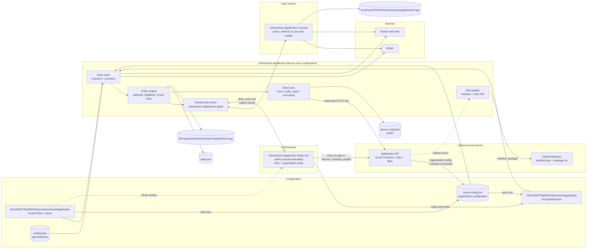

# Arkimentum AppMonitor

A Windows update-management agent for third-party applications. It watches the applications you
configure, gets new versions from **winget** or directly from the **vendor's web site**, tells the
user through a tray agent, and installs the update according to policy - optionally with a deadline
and a forced close of the application.

Built for cloud-only (Entra ID joined, Intune managed) fleets that need more control than
`winget upgrade --all` and less machinery than a full software-distribution product. Configuration is
read **from the registry**, so Group Policy, Intune or a simple script can drive it - or, optionally,
from an **organization configuration delivered by the cloud service**, in which case three registry
values per device are all you have to deploy.

- .NET 10, Windows x64
- A Windows service (`LocalSystem`), a per-session WPF tray agent and an elevated admin console
- Runs stand-alone with no call-home at all, or connected to the optional cloud service
- **Organization-managed configuration** - publish once, every enrolled device collects it
- **Device inventory and update reporting** - a fleet view of what is installed and what is behind
- **Agent self-update** from GitHub Releases, SHA-256 verified before anything is installed
- No network listeners; every connection is outbound HTTPS that the device itself initiates

## Prerequisites

- **Windows 10 or 11, x64.** The configuration is read from the 64-bit registry view.
- **No .NET runtime.** The default build is self-contained, so the service, the tray agent and the
  admin console carry their own runtime. Only a framework-dependent build
  (`Build-Release.ps1 -SelfContained:$false`) needs the .NET 10 Desktop Runtime x64 on every machine.
- **winget** (the `Microsoft.DesktopAppInstaller` package) is the only runtime prerequisite, and only
  for applications with `Source = winget`; web sources work without it. Because App Installer is a
  per-user MSIX, it is regularly missing for the `SYSTEM` account that the service runs as - so the
  service repairs it itself.

With `AutoInstallPrerequisites = 1` (the default) the service checks at startup and then every
`PrerequisiteCheckIntervalHours` (default 24) whether winget is available to SYSTEM and at least
`WingetMinimumVersion` (default `1.6.0`). If not, it installs or repairs it without involving the
user - through the `Microsoft.WinGet.Client` PowerShell module
(`Repair-WinGetPackageManager -AllUsers -Latest`), or by provisioning the App Installer bundle and its
VCLibs / Microsoft.UI.Xaml dependencies for all users. The tray agent then registers the provisioned
package for the signed-in user, so per-user updates work without administrative rights.

That needs outbound HTTPS to `github.com` (and `objects.githubusercontent.com`), `aka.ms`,
`nuget.org` and the PowerShell Gallery (`www.powershellgallery.com`,
`psg-prod-eastus.azureedge.net`). On machines without that access, provision App Installer in the
image and set `AutoInstallPrerequisites = 0`.

Check or repair by hand at any time:

```powershell
& "$env:ProgramFiles\Arkimentum\AppMonitor\Service\Arkimentum.AppMonitor.Service.exe" --prerequisites
# exit code 0 = healthy, 2 = winget still unavailable, 1 = the check itself failed
```

The admin console shows the same status on its Overview page, with an *Install or repair
prerequisites* button, and the installer runs the check once at the end (`-SkipPrerequisites` skips
it).

## Architecture



Everything in the *Optional cloud service* box is exactly that: with no `CloudServerUrl` configured the
agent never contacts it, and no data leaves the device.

Details, including the scan cycle, the update state machine and the IPC message table:
[`docs/Architecture.md`](docs/Architecture.md). The cloud side, end to end:
[`docs/Cloud.md`](docs/Cloud.md).

## What it does

| Behaviour | How it is configured | What the user sees |
| --- | --- | --- |
| **Optional update** | `Mandatory = 0` | A notification. The user installs when it suits them, or dismisses it; it comes back after `NotificationIntervalMinutes`. |
| **Mandatory update** | `Mandatory = 1`, `DeadlineHours` | The same notification, but deferrals are limited and the update is enforced at the deadline. |
| **Deferrals** | `MaxDeferrals`, `DeferralOptions` (e.g. `60,240,1440`) | "Remind me in 1 hour / 4 hours / tomorrow", until the deferrals run out or the deadline passes. |
| **Deadline** | `DeadlineHours` counted from first detection | After it, deferral is refused and the install proceeds. |
| **Forced close with grace period** | `ProcessNames`, `ForceCloseAtDeadline = 1`, `CloseGracePeriodMinutes` | A warning naming the applications to close, a countdown, then the windows are asked to close and finally terminated. |
| **Silent install** | `AutoInstall = 1` | Nothing, unless `ShowInstalledNotifications` is on - then a confirmation afterwards. |
| **System vs user context** | `Context = auto \| system \| user` | Machine-wide updates run as LocalSystem; per-user applications (VS Code User Setup, Slack, ...) are installed by the tray agent inside the user's own session. |
| **Notification cadence** | `NotificationIntervalMinutes` (global, per-app override) | At most one reminder per update per interval; no toast storms. |
| **Scan cadence** | `ScanIntervalMinutes`, `StartupDelaySeconds`, `ScanOnStartup` | Nothing - scans are silent. |

Applications are defined either fully in the registry, or by referencing an entry in the shipped
catalog (`catalog.json`) and overriding only what you care about. The catalog supplies identity,
source and detection data - winget ids, vendor URLs, regexes, process names - and never behaviour:
how mandatory, how strict and how forceful an update is always comes from your own settings.

## Admin console

`Arkimentum.AppMonitor.Admin.exe` is the graphical way to configure a machine: Start Menu →
Arkimentum → **Arkimentum AppMonitor Admin**. It elevates itself at startup, edits the local
preference key, and shows values that come from Group Policy or Intune as locked.

- **Overview** - service state with Start/Stop/Restart, "Scan now" through the service pipe, pending
  updates and the effective configuration.
- **Settings** and **Applications** - every global and per-app value, with "Override" per value and
  the built-in default when you do not override; "Test detection" runs the real winget or web check
  for one application.
- **Export & Import** - a JSON profile, a `.reg` file or an idempotent PowerShell script, ready for
  Intune (platform script or Win32 app), Group Policy Preferences, an RMM or another technician's
  machine. `--export` and `--import` also work headless.

With the cloud service in use, the same console also has an **Organization** mode: sign in with Entra
ID and manage the whole fleet - **Devices** (with Scan now, Report now, Repair prerequisites, Update
agent), **Inventory** across the organization, **Organization settings and applications** with
*Publish*, and **Enrollment** with ready-made provisioning snippets.

Changes take effect within one policy tick (`PolicyTickSeconds`, default 60 s) - no service restart.

Full documentation, including the distribution recipes and Merge/Replace semantics:
[`docs/AdminConsole.md`](docs/AdminConsole.md).

## Quick start

### 1. Build

```powershell
# user-local SDK (see BUILD-ENV.md); skip if dotnet is already on PATH
$env:DOTNET_ROOT = "$env:LOCALAPPDATA\Microsoft\dotnet"; $env:PATH = "$env:DOTNET_ROOT;$env:PATH"

.\deploy\Build-Release.ps1 -Version 1.0.0
```

Produces `artifacts\publish\` (Service, Tray, Admin, scripts, policy templates, docs) and
`artifacts\Arkimentum.AppMonitor-1.0.0.zip`. The default build is self-contained, so target machines need
no .NET runtime; `-SelfContained:$false` gives a smaller, framework-dependent build.

The build also runs the unit tests (210 at the time of writing); `-SkipTests` leaves them out. To run
them alone:

```powershell
dotnet test src/Arkimentum.AppMonitor.Tests
```

### 2. Install (elevated, on the target machine)

```powershell
.\Install-ArkimentumAppMonitor.ps1
```

Copies the binaries to `%ProgramFiles%\Arkimentum\AppMonitor` (`Service\`, `Tray\`, `Admin\`), creates
the `ArkimentumAppMonitor` service (LocalSystem, delayed auto-start, restart-on-failure), registers the
event log source, writes default preferences and a small sample application set, adds the tray agent's
logon Run value, creates the all-users Start Menu shortcut for the admin console, starts everything,
and finally runs the prerequisite check (`--prerequisites`) so winget is in place before the first
scan. Re-running it upgrades in place.

Useful switches: `-NoSampleApps`, `-NoAdminConsole`, `-SkipPrerequisites`, `-NoStart`,
`-ScanIntervalMinutes`, `-LogLevel`, `-LogFile`, `-Force`; and for the cloud service
`-CloudServerUrl`, `-CloudOrganizationId`, `-CloudEnrollmentKey`, `-AgentUpdateFeedUrl`,
`-NoAutoUpdate`.

### 3. Configure

There are two ways to run a fleet. Pick one; they use the same settings and the same console.

#### Path A - stand-alone (every device configured locally)

**Preferred: the admin console.** Start Menu → Arkimentum → **Arkimentum AppMonitor Admin** (it asks
for elevation). It edits every setting and application, shows the service and the pending updates, and
exports the result as a JSON profile, a `.reg` file or a deployment script for the rest of the fleet.
See [`docs/AdminConsole.md`](docs/AdminConsole.md).

Alternatives, all writing the same registry values:

- **Group Policy / Intune** - import `deploy\policy\ArkimentumAppMonitor.admx` and its `en-US\*.adml`
  (Computer Configuration → Administrative Templates → Arkimentum → AppMonitor). Policy wins over
  everything the console writes, and policy-managed values are shown locked in the console. See
  [`deploy/policy/README.md`](deploy/policy/README.md). This is the right choice for a managed fleet.
- **Registry, scripted** - `deploy\Set-SampleConfiguration.ps1` writes a complete, commented example.
- **Registry, by hand or by .reg file** - `deploy\Sample-Configuration.reg`, and the full reference in
  [`docs/Registry.md`](docs/Registry.md).

A minimal application entry:

```powershell
$key = 'HKLM:\SOFTWARE\Arkimentum\AppMonitor\Apps\chrome'
New-Item -Path $key -Force | Out-Null
Set-ItemProperty -Path $key -Name Source        -Value 'winget'
Set-ItemProperty -Path $key -Name WingetId      -Value 'Google.Chrome'
Set-ItemProperty -Path $key -Name Mandatory     -Value 1
Set-ItemProperty -Path $key -Name DeadlineHours -Value 72
Set-ItemProperty -Path $key -Name ProcessNames  -Value 'chrome'
Restart-Service ArkimentumAppMonitor
```

#### Path B - managed by the cloud

Deploy the cloud service once ([`cloud/README.md`](cloud/README.md)), create an organization, and then
provision **three values per device** - nothing else. Everything else is published once in the console
and collected by every device on its own.

```powershell
.\Install-ArkimentumAppMonitor.ps1 -NoSampleApps `
    -CloudServerUrl      'https://appmonitor-contoso.azurewebsites.net' `
    -CloudOrganizationId '3f2504e0-4f89-11d3-9a0c-0305e82c3301' `
    -CloudEnrollmentKey  'ek_live_...'
```

Or write the same three `REG_SZ` values with an Intune platform script, with the ADMX setting
*Organization connection*, or by hand - the console's **Enrollment** page generates each snippet with
your real values in it.

The device enrols on its first sync, exchanges the enrollment key for a per-device key (DPAPI-protected
in `%ProgramData%\Arkimentum\AppMonitor\device.credential`), collects the organization configuration,
and reports its inventory and update state after each scan. Configure the rest in the admin console's
**Organization** mode: Devices, Inventory, Organization settings and applications (with *Publish*), and
Enrollment.

```powershell
# on the device, after provisioning
& "$env:ProgramFiles\Arkimentum\AppMonitor\Service\Arkimentum.AppMonitor.Service.exe" --cloud-status
```

Precedence becomes **policy → organization configuration → local preference → catalog → default**, so a
Group Policy setting still wins on the devices that have one, and the cloud can never change the three
connection values themselves. Data flows, the exact list of fields that leave the device, offline
behaviour and troubleshooting: [`docs/Cloud.md`](docs/Cloud.md). Agent self-update:
[`docs/SelfUpdate.md`](docs/SelfUpdate.md).

### 4. Verify

```powershell
Get-Service ArkimentumAppMonitor
Get-Content "$env:ProgramData\Arkimentum\AppMonitor\Logs\Arkimentum.AppMonitor.Service_$(Get-Date -Format yyyyMMdd).log" -Tail 50
```

The tray icon appears in the notification area of every interactive session; its menu shows the
pending updates, the last scan time and the effective settings.

### Troubleshooting: run the service in a console

```powershell
Stop-Service ArkimentumAppMonitor
& "$env:ProgramFiles\Arkimentum\AppMonitor\Service\Arkimentum.AppMonitor.Service.exe" --console
```

Logs to the console as well as the log file, and keeps serving the pipe so the tray agent still
works. Run it from an elevated prompt: the executable is `asInvoker`, and without elevation it warns
that machine-wide installs and other users' inventory will fail.

| Switch | Effect |
| --- | --- |
| `--console` | Run interactively (Ctrl+C to stop). |
| `--scan-once` | One scan in the console, then exit. |
| `--show-config` | Print the effective configuration, the resolved applications and where each value came from. |
| `--prerequisites` | Run the winget prerequisite check (and the install/repair) once, then exit: 0 = healthy, 2 = still unavailable, 1 = error. |
| `--no-delay` | Skip the startup delay. |
| `--user-config` | Testing only: read `HKCU` instead of `HKLM` and keep logs/state in `%LOCALAPPDATA%`, so the pipeline can be exercised without admin rights. |
| `--cloud-status` | Print the cloud link's state: enrolled or not, device id, last sync, applied configuration version, last error. |
| `--cloud-enroll` | Enrol now with the configured organization id and enrollment key. |
| `--report-now` | Build and send a report immediately. |
| `--check-update` | Check the release feed and print what it found, without installing. |
| `--update-now` | Check, download, verify (SHA-256) and install a newer agent release now. |
| `--version` | Print the version. |

More in [`docs/Troubleshooting.md`](docs/Troubleshooting.md).

### Uninstall

```powershell
.\Uninstall-ArkimentumAppMonitor.ps1                               # keep configuration and logs
.\Uninstall-ArkimentumAppMonitor.ps1 -RemoveConfiguration -RemoveData
```

The Group Policy key `HKLM\SOFTWARE\Policies\Arkimentum\AppMonitor` is never touched - unassign the
policy instead.

`-RemoveData` deletes `%ProgramData%\Arkimentum\AppMonitor` and with it everything the cloud side keeps
on the device: `device.credential`, `cloud-config.json`, `cloud-status.json` and `AgentUpdates\`. That
un-enrols the device locally; the record in the cloud is untouched, so remove it on the console's
Devices page as well if the machine is gone for good.

## Where things live

| What | Where |
| --- | --- |
| Service binaries | `%ProgramFiles%\Arkimentum\AppMonitor\Service\` |
| Tray binaries | `%ProgramFiles%\Arkimentum\AppMonitor\Tray\` |
| Admin console | `%ProgramFiles%\Arkimentum\AppMonitor\Admin\Arkimentum.AppMonitor.Admin.exe` |
| Admin console shortcut | All users: `Start Menu\Programs\Arkimentum\Arkimentum AppMonitor Admin` |
| Service log | `%ProgramData%\Arkimentum\AppMonitor\Logs\Arkimentum.AppMonitor.Service_yyyyMMdd.log` |
| Tray log (per user) | `%LOCALAPPDATA%\Arkimentum\AppMonitor\Logs\Arkimentum.AppMonitor.Tray_yyyyMMdd.log` |
| Admin console log | `%ProgramData%\Arkimentum\AppMonitor\Logs\Arkimentum.AppMonitor.Admin_yyyyMMdd.log` |
| State | `%ProgramData%\Arkimentum\AppMonitor\state.json` |
| Configuration | `HKLM\SOFTWARE\Policies\Arkimentum\AppMonitor` (wins), the cached organization configuration, `HKLM\SOFTWARE\Arkimentum\AppMonitor` |
| Device credential | `%ProgramData%\Arkimentum\AppMonitor\device.credential` (DPAPI; SYSTEM + Administrators only) |
| Organization configuration | `%ProgramData%\Arkimentum\AppMonitor\cloud-config.json` |
| Cloud status | `%ProgramData%\Arkimentum\AppMonitor\cloud-status.json` |
| Downloaded agent releases | `%ProgramData%\Arkimentum\AppMonitor\AgentUpdates\` |
| Event log | Application log, source `Arkimentum AppMonitor` |

## Security notes

- **IPC is local only.** The named pipe `Arkimentum.AppMonitor.Agent` grants Authenticated Users
  read/write and LocalSystem/Administrators full control. The service establishes the caller's SID
  and session by impersonating the pipe client rather than trusting the message, so a user cannot act
  on another user's updates. No TCP/UDP port is opened.
- **Installs run as SYSTEM.** Machine-wide updates - including winget - execute with full privileges.
  Whoever can write `HKLM\SOFTWARE\Arkimentum\AppMonitor` (administrators) or the catalog file controls
  what is downloaded and executed as SYSTEM. Keep the catalog file and the install folder writable by
  administrators only, and prefer the Policies key, which standard users cannot write at all.
- **Downloads are verified when configured.** Web sources support `Sha256` or `Sha256Url`; when a
  hash is configured the download must match it before the installer runs. Always use HTTPS URLs.
- **The cloud link is outbound only, and device-authenticated.** No listener is opened for it. The
  enrollment key is used once and exchanged for a per-device key kept DPAPI-protected and ACLed to
  SYSTEM and Administrators; administrator access to the service is Entra ID, on a separate route
  prefix from the device endpoints. Commands from an administrator are queued and collected by the
  device, never pushed to it. What is reported is listed field by field in
  [`docs/Cloud.md`](docs/Cloud.md#what-leaves-the-device); `CloudReportingEnabled = 0` turns it off.
- **Self-update verifies before it installs.** The downloaded package must match the SHA-256 in the
  release manifest or nothing is extracted or executed. `AgentAutoUpdate = 0` disables the mechanism
  when another tool owns the binaries.
- **Code signing.** Production binaries and the installer script should be Authenticode-signed (the
  build script does not sign; add signing to your release pipeline - see the note in
  [`docs/Cloud.md`](docs/Cloud.md#code-signing)), so that WDAC/AppLocker policies and users can tell
  the agent apart from a look-alike. This matters more with self-update enabled, since the device then
  runs a downloaded script as SYSTEM.
- **Least privilege for the tray agent.** It runs as the signed-in user; per-user installs therefore
  succeed or fail with that user's rights - it does not elevate.
- **Logs contain application names, versions, user names and SIDs.** Treat exported logs and
  `state.json` as operational data.

## Known limitations

- **winget output parsing.** Update detection depends on winget's command output; a winget release
  that changes the format, or arguments in `WingetGlobalArgs` that change it, can break detection.
  Packages whose installed version winget reports as "Unknown" are skipped unless
  `WingetIncludeUnknown = 1`.
- **winget must work for the SYSTEM account.** App Installer is a per-user MSIX; on machines where it
  is not provisioned for all users, winget-based applications fail until it is. The service repairs
  this itself when `AutoInstallPrerequisites = 1`, but that needs internet access to GitHub, aka.ms
  and the PowerShell Gallery - an isolated machine still has to have App Installer in its image (see
  [`docs/Troubleshooting.md`](docs/Troubleshooting.md)).
- **Web sources depend on vendor pages.** A redesigned download page, a changed URL pattern or a new
  file-name scheme breaks `VersionRegex`/`DownloadUrl` until the entry is updated. Vendors that
  require a click-through, a login or JavaScript cannot be used as web sources.
- **MSIX/AppX applications.** Store-delivered and MSIX apps do not appear in the Uninstall registry
  keys the inventory reads, and they update through their own channels; they are not managed here.
  Prefer the Store/Intune mechanisms for those.
- **Per-user applications need a logged-on user.** Updates for a user who never signs in are never
  installed, and the machine inventory cannot see a user hive that is not loaded.
- **Reboots are never forced.** If an installer requires a reboot, the agent records it; scheduling
  the restart is left to your normal patching process.
- **x64 Windows only**, and the configuration must be written in the 64-bit registry view.

## Repository layout

```
src\Arkimentum.AppMonitor.Core      shared library: registry reader, models, inventory, providers, IPC,
                                    settings schema/export/import, logging
src\Arkimentum.AppMonitor.Service   Windows service (worker host)
src\Arkimentum.AppMonitor.Tray      WPF tray agent
src\Arkimentum.AppMonitor.Admin     WPF admin console (elevated configuration UI + headless export/import)
src\Arkimentum.AppMonitor.UI        shared WPF brand theme, styles and controls
src\Arkimentum.AppMonitor.Tests     xunit tests
catalog\catalog.json            application catalog
cloud\                          optional cloud service: Azure Functions API, Bicep, Deploy-Cloud.ps1
deploy\                         build, install, uninstall and configuration scripts + ADMX template
docs\                           registry reference, architecture, admin console, cloud, self-update,
                                troubleshooting
```

Operators deploying the backend want [`cloud/README.md`](cloud/README.md); administrators connecting
devices to it want [`docs/Cloud.md`](docs/Cloud.md).

Build prerequisites: [`BUILD-ENV.md`](BUILD-ENV.md).
