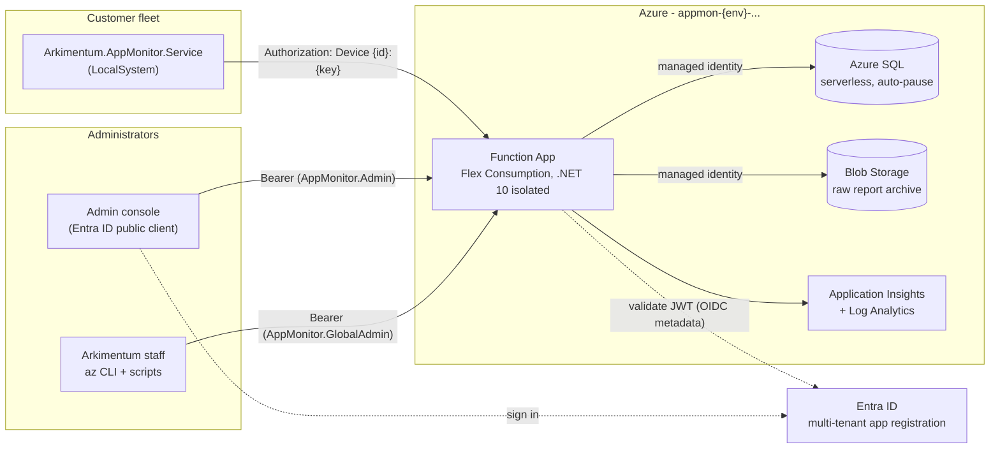

# Arkimentum AppMonitor - cloud backend

The multi-tenant SaaS side of AppMonitor: Windows agents enrol, poll their organization's configuration and report
what is installed; Arkimentum staff and the customers' own IT administrators manage it through the admin console.

Everything here is deployable code and infrastructure-as-code. Nothing in this folder has been deployed - the
machine it was written on has no Azure credentials.

```
cloud/
  api/Arkimentum.AppMonitor.Api          Azure Functions (.NET 10 isolated worker)
  api/Arkimentum.AppMonitor.Api.Tests    xunit: contract, validation, handler and auth tests
  infra/main.bicep                       resource-group scoped infrastructure
  deploy/Deploy-Cloud.ps1                one-shot, idempotent deployment
  deploy/New-Organization.ps1            create a customer organization
  deploy/Rotate-EnrollmentKey.ps1        rotate an organization's enrollment key
  docs/openapi.yaml                      the wire contract as OpenAPI 3.0.3
```

---

## 1. Architecture



The agent itself is unchanged: it still reads its configuration from the registry. The cloud simply supplies a
**third configuration layer** - the organization configuration - and a place to report to. Three registry values
switch it on:

| Value | Example | Meaning |
| --- | --- | --- |
| `CloudServerUrl` | `https://appmon-prod-func-ab12cd.azurewebsites.net` | base URL of the API |
| `CloudOrganizationId` | `7b6b2b1e-1f0e-4a1a-8b1e-0f0e1a2b3c4d` | the organization GUID |
| `CloudEnrollmentKey` | `ek_live_kQ7fZ2x1Tn8sV4bR6mJpL9wC3yA0dE5uH7gK2iN1oQs` | the enrollment secret, used once per device |

### Target framework

**`net10.0`.** `Microsoft.Azure.Functions.Worker` 2.52.0 ships a `lib/net10.0` asset, and
`Microsoft.Azure.Functions.Worker.Sdk` 2.1.0 recognises `.NETCoreApp v10.0` as the `net10-isolated` tooling
target, so the Functions v4 host supports it. The Bicep template asks the Flex Consumption plan for
`runtime: { name: 'dotnet-isolated', version: '10.0' }`.

The API project does **not** reference `Arkimentum.AppMonitor.Core`: Core targets `net10.0-windows`, which a
portable `net10.0` assembly cannot reference, and the Function App runs on Linux. The contracts, the settings
schema, the settings validation and the version comparer are therefore *ported* into
`api/Arkimentum.AppMonitor.Api/Contracts/` and `.../Services/VersionComparer.cs`. The test project - which is
`net10.0-windows` - references **both** and asserts they agree; see
[§6 Tests](#6-tests). That is the mechanism that keeps the duplication honest, and it already earned its
keep once: it caught a `SettingsSchema` edit in Core (the `AgentTargetVersion` title) that landed while this
backend was being written.

---

## 2. Security model

### What is stored, and how

| Secret | At rest | Returned |
| --- | --- | --- |
| Organization enrollment key | SHA-256 only (`Organizations.EnrollmentKeyHash`) | once, at creation and at rotation; newly issued keys are prefixed `ek_live_` |
| Per-device key | SHA-256 only (`Devices.DeviceKeyHash`) | once, in the enrollment response |
| SQL credentials | none exist - Entra-only authentication, managed identity | - |
| Storage keys | none exist - `allowSharedKeyAccess: false` | - |

Both keys are 256 random bits from `RandomNumberGenerator`, rendered as base64url (43 characters). Verification
is `CryptographicOperations.FixedTimeEquals` on the SHA-256, so response timing reveals nothing about the key.
There is no Key Vault in the template because there is no secret that needs one.

Enrollment keys additionally carry the literal prefix **`ek_live_`** (so 51 characters in total, e.g.
`ek_live_kQ7fZ2x1Tn8sV4bR6mJpL9wC3yA0dE5uH7gK2iN1oQs`). The prefix has no meaning to the API - `Secrets.Hash`
hashes the string exactly as presented, prefix included - but it makes the value recognisable to secret scanners
and to whoever finds it in a GPO, a ticket or a deployment script. Keys issued before the prefix existed keep
working unchanged; rotating an organization hands out a prefixed one. Device keys are not prefixed: they never
leave the machine that owns them.

### Device authentication

`Authorization: Device {deviceId}:{deviceKey}`. The device row is looked up by id, the key is compared in fixed
time, and the request is rejected if the device is soft-deleted or its organization is inactive. Every subsequent
query is scoped by the `OrganizationId` that came out of that lookup - never by anything in the request body.

Enrollment matches on `(OrganizationId, MachineGuid)`, so a re-imaged machine re-attaches to its own history
instead of becoming a duplicate. Every enrollment issues a **new** device key and invalidates the old one, which
is also how key rotation works: re-enrol.

`POST /device/enroll` is rate-limited in memory, per source address (default 20 per 10 minutes) and per
organization (default 200 per 10 minutes). The limiter is per worker instance - it is a brute-force brake, not a
quota. Guessing a key is a 2^256 problem; the limiter exists so that a leaked *organization id* cannot be used to
hammer the endpoint cheaply.

### Administrator authentication

The API is a **multi-tenant** Entra ID app registration exposing one delegated scope, `AppMonitor.Admin`, and two
app roles:

| App role | Who | What |
| --- | --- | --- |
| `AppMonitor.Admin` | the customer's IT staff | manage the one organization mapped to the caller's `tid` |
| `AppMonitor.GlobalAdmin` | Arkimentum staff | manage every organization |

Tokens are validated with `Microsoft.IdentityModel` against the v2.0 OIDC metadata: signature, lifetime, audience
pinned to the API application id, and a custom issuer validator that requires the issuer to be
`https://login.microsoftonline.com/{tid}/v2.0` for the token's **own** `tid` claim - a multi-tenant API cannot
pin a single issuer, and accepting any issuer would be the classic multi-tenant hole. The `scp` claim must
contain `AppMonitor.Admin`.

`AppMonitor.GlobalAdmin` is honoured **only** when `tid` equals the configured `OperatorTenantId`. A customer
administrator who assigns themselves a role called `AppMonitor.GlobalAdmin` in their own tenant gains nothing;
there is a test for exactly that (`GlobalAdminRole_FromAnotherTenant_IsIgnored`).

### Tenant isolation

Every table carries an `OrganizationId`, and every admin request funnels through one method,
`AdminService.ResolveAsync`, which is the only place that decides what a caller may reach. It returns **403, not
404**, for an organization that does not exist, so an id cannot be confirmed by probing. `AdminServiceTests`
covers the cross-tenant cases directly.

### Threat notes

| Threat | Mitigation | Residual risk |
| --- | --- | --- |
| **Enrollment key leaks** (a script, a ticket, an escaped image) | The key only lets an attacker *enrol a device* into the organization. It cannot read configuration for another device, cannot read inventory, and cannot reach the admin API. Rotate with `Rotate-EnrollmentKey.ps1`; enrolled devices are unaffected. | Between leak and rotation, an attacker can register a fake device and read the organization's configuration (application list, deadlines, URLs). Treat the organization configuration as "confidential to the customer", not as a secret. |
| **Device key leaks** (a stolen disk) | The key is DPAPI-protected per machine by the agent. It is scoped to one device: it reads configuration and posts reports for that device only. Delete the device in the console to revoke it instantly. | An attacker with the key can post false inventory for that one device. |
| **Cross-tenant access** | `tid` -> `Organizations.EntraTenantId`, checked on every call; `GlobalAdmin` gated on the operator tenant. | A customer administrator who is deliberately given the role by Arkimentum. |
| **Config poisoning** | The configuration drives installs that run as SYSTEM, so writes require the `AppMonitor.Admin` role and are validated against `SettingsSchema` before being stored. Every write is versioned and kept in `OrganizationConfigHistory` with who/when/comment. | A compromised customer administrator account. Enable Conditional Access / PIM on the role assignment. |
| **Report flooding** | Reports are capped (5000 apps, 2000 updates, 1000 events, 200 acknowledgements) and per-device events are pruned to the newest 500. | A device can still post often; the Flex Consumption plan absorbs it and Application Insights shows it. |
| **SQL injection** | EF Core parameterises everything; there is no raw SQL in the API. | - |
| **Secret sprawl** | No connection strings, no storage keys, no client secrets anywhere - managed identity throughout. | The `sqlAdminObjectId` principal owns the database; make it a PIM-eligible group. |

### Transport and network

HTTPS only, minimum TLS 1.2, FTPS disabled, CORS with an empty origin list (the admin console is a desktop app,
so no browser origin is ever allowed). Azure SQL is reached through the "allow Azure services" firewall rule
because a Consumption-plan Function App has no stable outbound address; move to VNet integration plus a private
endpoint when a customer requires it.

---

## 3. Data model

EF Core with the SQL Server provider; the migration is in `api/Arkimentum.AppMonitor.Api/Data/Migrations`.

| Table | Key | Notes |
| --- | --- | --- |
| `Organizations` | `Id` | `EntraTenantId` unique (filtered on `IS NOT NULL`), `EnrollmentKeyHash` |
| `OrganizationConfigs` | `OrganizationId` | current `ConfigVersion` + `SettingsJson` |
| `OrganizationConfigHistory` | `Id` | one row per save: version, json, who, when, comment |
| `Devices` | `Id` | unique `(OrganizationId, MachineGuid)`; indexes on `(OrganizationId, IsDeleted, DeviceName)` and `(OrganizationId, LastSeenUtc)` |
| `DeviceApps` | `Id` | latest snapshot, replaced per report; indexes on `DeviceId`, `(OrganizationId, WingetId)`, `(OrganizationId, DisplayName)` |
| `DeviceUpdates` | `Id` | latest snapshot, replaced per report |
| `DeviceEvents` | `Id` | append-only; indexes on `(OrganizationId, OccurredUtc)` and `(DeviceId, OccurredUtc)` |
| `DeviceCommands` | `Id` | `DeliveredUtc` + `AcknowledgedUtc`; index on `(DeviceId, AcknowledgedUtc)` |
| `ReleaseManifests` | `Channel` | the agent-release mirror |
| `AuditLog` | `Id` | every mutating admin call; index on `(OrganizationId, Utc)` |

`ConfigVersion` is `{n}-{shorthash}`: a monotonically increasing counter so a human can see which is newer, and
the first four bytes of the SHA-256 of the stored JSON so an identical document keeps an identical tail.

---

## 4. Endpoints

Full detail, including every schema, in [`docs/openapi.yaml`](docs/openapi.yaml). Errors are always
`ApiError { code, message, traceId }`.

### Device (`Authorization: Device {deviceId}:{deviceKey}`)

| Method | Path | Notes |
| --- | --- | --- |
| POST | `/api/v1/device/enroll` | anonymous; rate-limited; returns the device key once |
| GET | `/api/v1/device/config` | ETag = `ConfigVersion`; honours `If-None-Match` |
| POST | `/api/v1/device/report` | replaces the snapshot, appends events, archives the raw body to Blob |
| GET | `/api/v1/device/release?channel=` | 404 when nothing is published |

**Commands and the 304.** Commands ride on the configuration response, so a plain "ETag matches -> 304" would
hide a queued command until somebody happened to change the configuration. The rule is therefore: **304 only when
the ETag matches *and* the device has no unacknowledged commands.** Otherwise a full 200 is returned with the same
`ConfigVersion` and the commands included. A command is stamped `DeliveredUtc` the first time it goes out, and
`AcknowledgedUtc` when the device lists it in `DeviceReport.acknowledgedCommands`; until then it is re-delivered
on every 200, at most 20 at a time.

### Public

| Method | Path | Notes |
| --- | --- | --- |
| GET | `/api/v1/public/auth-config` | client id, authority, scope - the console only needs the server URL |
| GET | `/api/v1/public/health` | liveness, used by the deploy script |

### Admin (`Authorization: Bearer <Entra ID token>`)

| Method | Path |
| --- | --- |
| GET | `/api/v1/admin/me` |
| GET, POST | `/api/v1/admin/organizations` |
| GET | `/api/v1/admin/organizations/{id}/devices?search=&page=&pageSize=` |
| GET, DELETE | `/api/v1/admin/organizations/{id}/devices/{deviceId}` |
| POST | `/api/v1/admin/organizations/{id}/devices/{deviceId}/commands` |
| GET | `/api/v1/admin/organizations/{id}/inventory?search=&onlyUnmonitored=` |
| GET, PUT | `/api/v1/admin/organizations/{id}/config` |
| GET | `/api/v1/admin/organizations/{id}/config/history` |
| GET | `/api/v1/admin/organizations/{id}/config/history/{historyId}` |
| GET | `/api/v1/admin/organizations/{id}/enrollment` |
| POST | `/api/v1/admin/organizations/{id}/enrollment/rotate` |
| GET, PUT | `/api/v1/admin/organizations/{id}/release?channel=` (PUT is global-admin only) |
| GET | `/api/v1/admin/organizations/{id}/events?since=&page=&pageSize=` |

---

## 5. Local development

Nothing here needs Azure. The API runs against SQLite and skips the Blob archive.

### Prerequisites

```powershell
# the user-local .NET 10 SDK (see BUILD-ENV.md)
$env:DOTNET_ROOT = "$env:LOCALAPPDATA\Microsoft\dotnet"; $env:PATH = "$env:DOTNET_ROOT;$env:PATH"

# Azure Functions Core Tools v4 - needed only for `func start`
npm install -g azure-functions-core-tools@4 --unsafe-perm true      # or winget install Microsoft.Azure.FunctionsCoreTools
func --version

# Azurite - needed only because the Functions host wants a storage account for its own bookkeeping
npm install -g azurite
azurite --silent --location .azurite
```

`api/Arkimentum.AppMonitor.Api/local.settings.json` is already set up for this: `SqlProvider=Sqlite` (the schema
is created from the model at start-up by `LocalDatabaseInitializer`), `BlobServiceUri` empty (no archive), and
`DevBypassAdminAuth=true` together with `AZURE_FUNCTIONS_ENVIRONMENT=Development`, which registers
`DevelopmentAdminTokenValidator` instead of the real one. It accepts

```
Authorization: Bearer dev:{tenantId}:{upn}:{role,role}
```

so the admin API can be exercised without an Entra tenant. **Both** settings are required, and neither exists in
Azure, so the bypass cannot be switched on by accident in a deployed environment.

### Run it

```powershell
cd cloud\api\Arkimentum.AppMonitor.Api
func start
# Functions:
#   DeviceEnroll: [POST] http://localhost:7071/api/v1/device/enroll
#   ...
```

### Walk through the whole flow

```powershell
$base = 'http://localhost:7071'
$operatorTenant = '11111111-1111-1111-1111-111111111111'   # matches OperatorTenantId in local.settings.json
$customerTenant = '22222222-2222-2222-2222-222222222222'
$globalAdmin = @{ Authorization = "Bearer dev:${operatorTenant}:ops@arkimentum.dk:AppMonitor.GlobalAdmin"; 'Content-Type' = 'application/json' }
$customerAdmin = @{ Authorization = "Bearer dev:${customerTenant}:it@contoso.com:AppMonitor.Admin"; 'Content-Type' = 'application/json' }

# 1. the console's bootstrap call
Invoke-RestMethod "$base/api/v1/public/auth-config"

# 2. create an organization (global admin only) - the enrollment key comes back once
$org = Invoke-RestMethod "$base/api/v1/admin/organizations" -Method Post -Headers $globalAdmin -Body (@{
    name = 'Contoso A/S'; entraTenantId = $customerTenant
} | ConvertTo-Json)
$orgId = $org.organization.organizationId
$enrollmentKey = $org.enrollment.enrollmentKey
"$orgId / $enrollmentKey"

# 3. publish a configuration (validated against SettingsSchema)
$settings = @{
    '$schema' = 'arkimentum-appmonitor-settings/1'
    global = @{ ScanIntervalMinutes = 240; NotificationsEnabled = $true; LogLevel = 'Information' }
    apps = @{ chrome = @{ Source = 'winget'; WingetId = 'Google.Chrome'; Mandatory = $true; DeadlineHours = 72; ProcessNames = @('chrome','chrome_proxy') } }
}
$saved = Invoke-RestMethod "$base/api/v1/admin/organizations/$orgId/config" -Method Put -Headers $customerAdmin `
    -Body (@{ settings = $settings; comment = 'Chrome, 72 h deadline' } | ConvertTo-Json -Depth 10)
$saved.configVersion        # e.g. 2-3f9a1c04

# 4. enrol a fake device
$enrolled = Invoke-RestMethod "$base/api/v1/device/enroll" -Method Post -ContentType 'application/json' -Body (@{
    organizationId = $orgId
    enrollmentKey  = $enrollmentKey
    deviceName     = 'CONTOSO-LT-0041'
    machineGuid    = '3f2504e0-4f89-11d3-9a0c-0305e82c3301'
    osVersion      = '10.0.26100.2314'
    agentVersion   = '1.0.0'
} | ConvertTo-Json)
$device = @{ Authorization = "Device $($enrolled.deviceId):$($enrolled.deviceKey)"; 'Content-Type' = 'application/json' }

# 5. poll the configuration, then poll again with the ETag -> 304
$config = Invoke-RestMethod "$base/api/v1/device/config" -Headers $device
$config.configVersion; $config.pollIntervalSeconds
(Invoke-WebRequest "$base/api/v1/device/config" -Headers ($device + @{ 'If-None-Match' = "`"$($config.configVersion)`"" }) -SkipHttpErrorCheck).StatusCode   # 304

# 6. queue a command, poll again -> 200 with the command even though the configuration is unchanged
$cmd = Invoke-RestMethod "$base/api/v1/admin/organizations/$orgId/devices/$($enrolled.deviceId)/commands" `
    -Method Post -Headers $customerAdmin -Body (@{ kind = 'scanNow' } | ConvertTo-Json)
(Invoke-RestMethod "$base/api/v1/device/config" -Headers ($device + @{ 'If-None-Match' = "`"$($config.configVersion)`"" })).commands

# 7. post a report that acknowledges it
Invoke-RestMethod "$base/api/v1/device/report" -Method Post -Headers $device -Body (@{
    reportedUtc          = (Get-Date).ToUniversalTime().ToString('o')
    agentVersion         = '1.0.0'
    osVersion            = '10.0.26100.2314'
    deviceName           = 'CONTOSO-LT-0041'
    lastLogonUser        = 'CONTOSO\hsk'
    lastScanUtc          = (Get-Date).ToUniversalTime().ToString('o')
    configVersionApplied = $config.configVersion
    prerequisites        = @{ wingetAvailable = $true; wingetMeetsMinimum = $true; wingetVersion = '1.9.25180' }
    installedApps        = @(
        @{ displayName = 'Google Chrome'; version = '131.0.6778.86'; publisher = 'Google LLC'; wingetId = 'Google.Chrome'; availableVersion = '132.0.6834.83'; context = 'system' },
        @{ displayName = '7-Zip 24.09 (x64)'; version = '24.09'; publisher = 'Igor Pavlov'; wingetId = '7zip.7zip'; context = 'system' }
    )
    updates              = @(@{ appId = 'chrome'; state = 'available'; installedVersion = '131.0.6778.86'; availableVersion = '132.0.6834.83'; mandatory = $true; firstDetectedUtc = (Get-Date).ToUniversalTime().ToString('o') })
    events               = @(@{ occurredUtc = (Get-Date).ToUniversalTime().ToString('o'); kind = 'updateDetected'; appId = 'chrome'; fromVersion = '131.0.6778.86'; toVersion = '132.0.6834.83' })
    acknowledgedCommands = @($cmd.commandId)
} | ConvertTo-Json -Depth 10)

# 8. see it in the admin API
Invoke-RestMethod "$base/api/v1/admin/organizations/$orgId/devices" -Headers $customerAdmin | Select-Object -ExpandProperty items
Invoke-RestMethod "$base/api/v1/admin/organizations/$orgId/inventory?onlyUnmonitored=true" -Headers $customerAdmin
Invoke-RestMethod "$base/api/v1/admin/me" -Headers $customerAdmin
```

The same with curl:

```bash
BASE=http://localhost:7071
ADMIN="Authorization: Bearer dev:22222222-2222-2222-2222-222222222222:it@contoso.com:AppMonitor.Admin"

curl -s $BASE/api/v1/public/auth-config
curl -s -X POST $BASE/api/v1/device/enroll -H 'Content-Type: application/json' \
  -d '{"organizationId":"<org>","enrollmentKey":"ek_live_<key>","deviceName":"PC-1","machineGuid":"abc"}'
curl -s -i $BASE/api/v1/device/config -H "Authorization: Device <deviceId>:<deviceKey>"
curl -s -i $BASE/api/v1/device/config -H "Authorization: Device <deviceId>:<deviceKey>" -H 'If-None-Match: "2-3f9a1c04"'
curl -s "$BASE/api/v1/admin/organizations/<org>/inventory" -H "$ADMIN"
```

### Tests

```powershell
dotnet test cloud\api\Arkimentum.AppMonitor.Api.Tests
```

---

## 6. Tests

231 tests in five groups.

| Group | What it proves |
| --- | --- |
| `ContractRoundTripTests` | Every DTO serialised with the API's converters, read back with **Core's** converters, re-serialised and compared byte for byte - in both directions. Also route constants, enum names *and numeric values*, camelCase enum strings, and null omission. |
| `SettingsValidationTests` | 37 sample values run through both `SettingsDocument.Validate()` implementations; the problem lists must match message for message. Plus a realistic complete document, every schema default, and the schema-version guard. |
| `SettingsSchemaParityTests` | Name, kind, category, title, description, min, max, choices, default and the `Advanced` flag of all 75 setting definitions, against Core. |
| `DeviceServiceTests`, `AdminServiceTests`, `InventoryTests` | Handlers against a real relational store (in-memory SQLite, not the InMemory provider, so unique indexes, foreign keys and `ExecuteDelete`/`ExecuteUpdate` behave as they will against Azure SQL). |
| `AdminAuthTests`, `VersioningTests` | Authentication and authorisation through a fake token validator, claim mapping through the real one, the global-admin gate, device-header parsing, key generation, and the version comparer against Core's. |

---

## 7. Deploying

### One command

```powershell
cd cloud\deploy
.\Deploy-Cloud.ps1 `
    -SubscriptionId    00000000-0000-0000-0000-000000000000 `
    -ResourceGroup     appmon-prod-rg `
    -Location          westeurope `
    -Environment       prod `
    -OperatorTenantId  11111111-1111-1111-1111-111111111111 `
    -OrganizationName  "Contoso A/S" `
    -CustomerTenantId  22222222-2222-2222-2222-222222222222
```

The script is idempotent; run it again to update. It prints the three registry values at the end. Useful
switches: `-WhatIfDeployment`, `-SkipAppRegistrations`, `-SkipPublish`, `-MigrationMode Bundle|Skip`,
`-UseFlexConsumption:$false`.

It is written for **Windows PowerShell 5.1** and works unchanged in pwsh 7, with one caveat: the step that makes
the Function App's managed identity a database user uses `System.Data.SqlClient` with an access token, which is
only in the GAC on Windows PowerShell. In pwsh 7, install the `SqlServer` module first
(`Install-Module SqlServer -Scope CurrentUser`) and the script uses `Invoke-Sqlcmd` instead. If neither is
available it writes `artifacts/cloud/{env}/grant-managed-identity.sql` and tells you to run it yourself.

### What it does

1. Checks `az` and `dotnet`, selects the subscription, reads the signed-in operator.
2. Creates the resource group.
3. Creates or patches the two app registrations (see §8).
4. Assigns `AppMonitor.GlobalAdmin` to the signed-in operator.
5. Deploys `infra/main.bicep`.
6. `CREATE USER [<function app>] FROM EXTERNAL PROVIDER` + `db_datareader` + `db_datawriter`.
7. Applies the EF migrations.
8. `dotnet publish` -> zip -> `az functionapp deployment source config-zip` (falling back to `az functionapp deploy`).
9. Creates the first organization through the admin API and prints `CloudServerUrl`, `CloudOrganizationId`,
   `CloudEnrollmentKey`.

### Database migrations - both ways

**From an operator workstation with the .NET SDK** (the default, `-MigrationMode Auto`):

```powershell
$env:DOTNET_ROOT = "$env:LOCALAPPDATA\Microsoft\dotnet"; $env:PATH = "$env:DOTNET_ROOT;$env:PATH"
cd cloud\api\Arkimentum.AppMonitor.Api
dotnet tool restore                      # restores dotnet-ef from cloud/.config/dotnet-tools.json
dotnet dotnet-ef database update --connection `
  "Server=tcp:appmon-prod-sql-ab12cd.database.windows.net,1433;Initial Catalog=appmon-prod-db;Authentication=Active Directory Default;Encrypt=True;"
```

`Authentication=Active Directory Default` makes `Microsoft.Data.SqlClient` use `DefaultAzureCredential`, which
picks up your `az login`. Your own IP must be allowed on the SQL server firewall
(`az sql server firewall-rule create -g <rg> -s <server> -n me --start-ip-address <ip> --end-ip-address <ip>`).

**As a migration bundle** (`-MigrationMode Bundle`), for a release pipeline or an operator without the SDK:

```powershell
cd cloud\api\Arkimentum.AppMonitor.Api
dotnet dotnet-ef migrations bundle --self-contained -r win-x64 -o ..\..\..\artifacts\cloud\prod\efbundle.exe
..\..\..\artifacts\cloud\prod\efbundle.exe --connection "Server=tcp:...;Authentication=Active Directory Default;Encrypt=True;"
```

The bundle is a single executable containing the migrations; it needs no SDK and no source.

Whoever runs the migration must be the SQL Entra administrator (or a member of the administrator group) - the
Function App's identity deliberately has no DDL rights.

### Resources created

| Resource | Name | Notes |
| --- | --- | --- |
| Function App | `appmon-{env}-func-{suffix}` | Flex Consumption FC1 (Linux), dotnet-isolated 10.0, system-assigned identity, HTTPS only, TLS 1.2, CORS empty |
| Plan | `appmon-{env}-plan` | FC1, or Y1 with `-UseFlexConsumption:$false` |
| Storage | `appmon{env}st{suffix}` | `reports` + `function-releases` containers, shared keys disabled, no public blob access |
| Azure SQL | `appmon-{env}-sql-{suffix}` / `appmon-{env}-db` | GP_S_Gen5 serverless, auto-pause 60 min, min 0.5 vCore, Entra-only auth |
| App Insights | `appmon-{env}-ai` | workspace-based |
| Log Analytics | `appmon-{env}-law` | 30 days (dev) / 90 days (prod) |

App settings written by the template: `AzureAd__ClientId`, `AzureAd__Audience`, `AzureAd__TenantIdMode`,
`AdminClientId`, `OperatorTenantId`, `SqlConnection` (managed identity, no password), `SqlProvider`,
`BlobServiceUri`, `ReportContainer`, `PublicServerUrl`, `PollIntervalSeconds`,
`APPLICATIONINSIGHTS_CONNECTION_STRING`, `AzureWebJobsStorage__accountName` + `__credential=managedidentity`.

Role assignments: Storage Blob Data Owner, Storage Queue Data Contributor and Storage Table Data Contributor on
the storage account (the Functions host needs blob, queue and table for its own bookkeeping, and the API needs
blob for the report archive), and Monitoring Metrics Publisher on Application Insights.

---

## 8. Entra ID setup

### In the operator (Arkimentum) tenant - done by `Deploy-Cloud.ps1`

**API app registration** - "Arkimentum AppMonitor API ({env})"

- `signInAudience`: `AzureADMultipleOrgs` (multi-tenant)
- Identifier URI: `api://{apiAppId}`
- `api.requestedAccessTokenVersion`: `2`
- Delegated scope `AppMonitor.Admin` (admin- and user-consentable)
- App roles `AppMonitor.Admin` and `AppMonitor.GlobalAdmin`, both `User` and `Application` member types
- Pre-authorised applications for the scope: the admin console client, and the Microsoft Azure CLI
  (`04b07795-8ddb-461a-bbee-02f9e1bf7b46`) so `New-Organization.ps1` and `Rotate-EnrollmentKey.ps1` can call the
  admin API with `az account get-access-token`. Pre-authorisation only removes the consent prompt - the caller
  still needs an app role assignment.

**Admin console app registration** - "Arkimentum AppMonitor Admin Console ({env})"

- `signInAudience`: `AzureADMultipleOrgs`
- Public client (`isFallbackPublicClient: true`), redirect URI `http://localhost` (MSAL interactive)
- Requires the `AppMonitor.Admin` scope on the API

The scope and app-role GUIDs are constants at the top of `Deploy-Cloud.ps1`. **Never change them** once a customer
tenant has consented - a new id means a new consent.

### In a customer tenant

1. **Admin consent.** Send the customer's Global Administrator:

   ```
   https://login.microsoftonline.com/{customerTenantId}/adminconsent?client_id={apiAppId}
   https://login.microsoftonline.com/{customerTenantId}/adminconsent?client_id={adminConsoleAppId}
   ```

   Consenting creates service principals ("enterprise applications") for both in their tenant. Nothing is granted
   to anyone yet.

2. **Require assignment** (recommended). Entra admin center -> Enterprise applications ->
   *Arkimentum AppMonitor API* -> Properties -> **Assignment required? Yes**. Now only people who are explicitly
   assigned can get a token at all.

3. **Assign `AppMonitor.Admin` to the IT staff.** Enterprise applications -> *Arkimentum AppMonitor API* ->
   Users and groups -> Add user/group -> pick a group (e.g. "AppMonitor Administrators") -> Role:
   **AppMonitor Administrator**. Or with the CLI, in the customer tenant:

   ```powershell
   $apiSp = az ad sp list --filter "appId eq '$apiAppId'" --query "[0].id" -o tsv
   $role  = az ad sp show --id $apiSp --query "appRoles[?value=='AppMonitor.Admin'].id | [0]" -o tsv
   $group = az ad group show --group "AppMonitor Administrators" --query id -o tsv
   az rest --method POST --uri "https://graph.microsoft.com/v1.0/servicePrincipals/$apiSp/appRoleAssignedTo" `
           --headers Content-Type=application/json `
           --body "{\"principalId\":\"$group\",\"resourceId\":\"$apiSp\",\"appRoleId\":\"$role\"}"
   ```

4. **Tell Arkimentum the tenant id**, so the organization can be mapped:

   ```powershell
   .\New-Organization.ps1 -ServerUrl https://appmon-prod-func-ab12cd.azurewebsites.net `
                          -ApiClientId <apiAppId> -Name "Contoso A/S" -EntraTenantId <customerTenantId>
   ```

5. **Hand over the three registry values** and deploy them by Group Policy or Intune. Prefer the Policies key -
   standard users cannot write it at all.

Assigning `AppMonitor.GlobalAdmin` in a customer tenant has no effect: the API only honours that role for tokens
whose `tid` is the configured `OperatorTenantId`.

---

## 9. Cost estimate

West Europe, pay-as-you-go list prices, EUR, per month. A "small" tenancy is ~500 devices reporting every 15
minutes across all organizations; "medium" is ~5 000.

| Component | Small (500 devices) | Medium (5 000 devices) | Driver |
| --- | --- | --- | --- |
| Function App (Flex Consumption) | 0 - 3 | 15 - 30 | ~1.5 M requests/month at 5 000 devices; the free grant covers most of the small case |
| Azure SQL serverless (GP_S_Gen5, 0.5-2 vCore, auto-pause) | 12 - 25 | 60 - 110 | vCore-seconds while awake. At 15-minute polling the database never pauses; raise `CloudSyncIntervalMinutes` to 60 and it does. Storage ~0.11/GB |
| Blob Storage (raw report archive) | 1 - 2 | 8 - 15 | ~30 KB per report -> ~1 GB/month at 500 devices, ~10 GB at 5 000. Add a lifecycle rule to cool/archive after 30 days |
| Application Insights + Log Analytics | 2 - 5 | 10 - 25 | ~2.30/GB ingested after the 5 GB free grant; sampling is on in `host.json` |
| **Total** | **~15 - 35** | **~95 - 180** | |

Levers, in order of effect:

1. **Polling interval.** `CloudSyncIntervalMinutes` drives everything. 15 minutes keeps the serverless database
   permanently awake; 60 minutes lets it auto-pause overnight and at weekends and roughly halves the SQL bill.
2. **Report archive retention.** The archive is for forensics, not for queries - a lifecycle rule to Cool at 30
   days and Archive at 90 cuts storage by ~80 %.
3. **Log Analytics retention.** 30 days is plenty for an API this size.
4. **`sqlAutoPauseDelayMinutes`.** Shorter pause delay saves money but every first request after a pause waits
   ~30-60 s for the database to resume. `EnableRetryOnFailure` in `Program.cs` covers that, and devices retry
   anyway, but the admin console will feel it. 60-120 minutes is the sweet spot.

Not included: the Entra ID app registrations (free), egress (negligible), and the optional release mirror in Blob
Storage (a few GB per release).

---

## 10. Recommended contract additions

`src/Arkimentum.AppMonitor.Core/Cloud/CloudContracts.cs` is the source of truth and was treated as read-only while
this backend was written. Five shapes the admin console needs were missing from it; they have since been added to
Core and are now covered by the round-trip tests like everything else:

| Shape | Used by | Why |
| --- | --- | --- |
| `PagedResult<T> { items, total, page, pageSize }` | `GET .../devices`, `.../config/history`, `.../events` | The brief asks for "list + total"; a bare array cannot carry the total. |
| `CreateOrganizationRequest { name, entraTenantId? }` | `POST /admin/organizations` | The brief specifies the body `{name, entraTenantId}`. |
| `CreateOrganizationResponse { organization, enrollment }` | `POST /admin/organizations` | The brief asks for `OrganizationSummary` **and** `EnrollmentInfoResponse` in one response. |
| `ConfigHistoryEntry`, `OrganizationEvent` | `GET .../config/history`, `GET .../events` | `ReportedEvent` has no device identity, so the organization-wide event feed cannot use it as-is. |

### Viewing and restoring an old configuration revision

`ConfigHistoryEntry` deliberately carries no `settings`: the history list would otherwise ship the full
configuration JSON for every revision on every page load. One revision is fetched on demand instead:

```
GET /api/v1/admin/organizations/{id}/config/history/{historyId}   ->  OrganizationConfigResponse
```

`configVersion`, `updatedUtc` and `updatedBy` in that response are the **historical** values. The endpoint
returns **no ETag**, on purpose: restoring is a normal

```
PUT /api/v1/admin/organizations/{id}/config
If-Match: "<the CURRENT ConfigVersion>"
{ "settings": <the settings from the revision>, "comment": "Restored 4-1a2b3c4d" }
```

which creates a *new* revision on top rather than rewinding the history, and keeps the audit trail intact. If the
console were to send the historical version as `If-Match` it would always get a 409 - which is why the ETag is
withheld rather than left to be misread.

A `historyId` belonging to a different organization is a 404, not a cross-tenant read; the organization id is part
of the query predicate.

One behavioural clarification worth writing into the XML comment on `DeviceConfigResponse.Commands`: **a 304 is
returned only when the ETag matches and there are no unacknowledged commands** (see §4). An agent that treats 304
as "nothing to do" is correct; an agent that stops sending `If-None-Match` because it is waiting for a command is
not necessary.

Two smaller observations, no change required:

- `PrerequisiteStatus.IsHealthy` and `.Summary` are computed, get-only properties without `[JsonIgnore]`, so
  `System.Text.Json` **writes** them. The API's copy reproduces them deliberately so the two serialisations stay
  byte-identical. If you ever add `[JsonIgnore]` to them in Core, do it in both places in the same commit -
  `ContractRoundTripTests.PrerequisiteStatus_RoundTrips` will fail otherwise.
- The keys inside `SettingsDocument.global` / `.apps` are **not** camelCased (the serializer options set
  `PropertyNamingPolicy` but not `DictionaryKeyPolicy`), which is right - they are registry value names. Worth a
  sentence in the contract so nobody "fixes" it.

---

## 11. Operations

| Task | How |
| --- | --- |
| Rotate an enrollment key | `.\Rotate-EnrollmentKey.ps1 -ServerUrl ... -ApiClientId ... -OrganizationId ...` |
| Add an organization | `.\New-Organization.ps1 -ServerUrl ... -ApiClientId ... -Name ... -EntraTenantId ...` |
| Revoke one device | `DELETE /api/v1/admin/organizations/{id}/devices/{deviceId}` - soft-deletes, clears the key hash and drops the snapshot |
| Deactivate an organization | set `Organizations.IsActive = 0`; enrollment is refused and every device credential stops working |
| See who changed what | `AuditLog`, and `GET .../config/history` for configuration |
| Find a device's raw reports | Blob `reports/{organizationId}/{deviceId}/{yyyy}/{MM}/*.json` |
| Trace a failing call | The `traceId` in every `ApiError` is the Application Insights operation id |
| Publish an agent release | `PUT /api/v1/admin/organizations/{any}/release?channel=stable` as a global admin; devices read it from `GET /api/v1/device/release` |

Backups: the database has 7 days of point-in-time restore (`sqlBackupRetentionDays`); raise it for production.
Blob soft-delete is on for 7 days.
