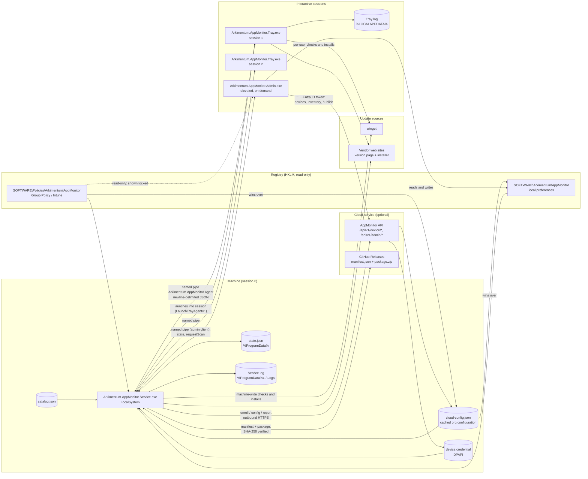
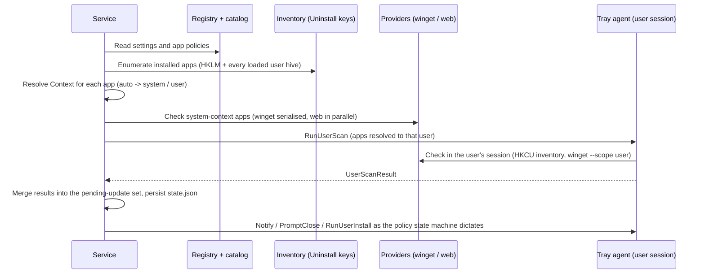
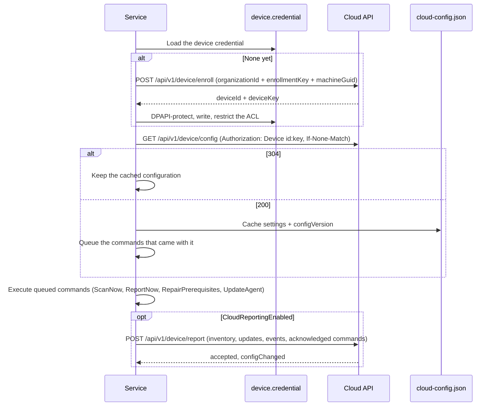
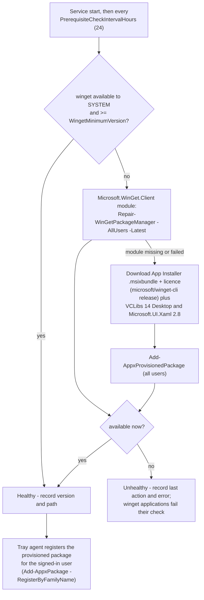
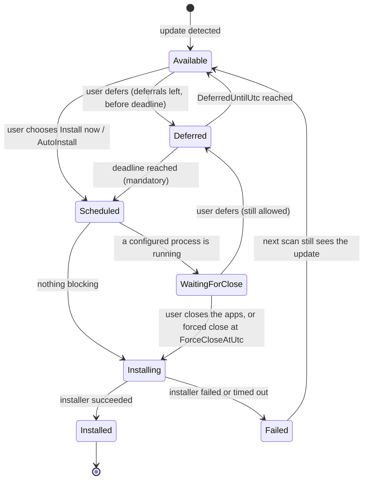

# Architecture

## Components

| Component | Project | Runs as | Responsibility |
| --- | --- | --- | --- |
| Service | `src\Arkimentum.AppMonitor.Service` → `Arkimentum.AppMonitor.Service.exe` | LocalSystem, service `ArkimentumAppMonitor` (delayed auto-start) | Reads the configuration, scans for updates, tracks state, enforces deadlines, installs machine-wide updates, hosts the named pipe, launches tray agents. |
| Tray agent | `src\Arkimentum.AppMonitor.Tray` → `Arkimentum.AppMonitor.Tray.exe` | The logged-on user, one instance per interactive session | Tray icon and toasts, deferral/install choices, closing the user's applications, and per-user scans and installs in that user's session. |
| Admin console | `src\Arkimentum.AppMonitor.Admin` → `Arkimentum.AppMonitor.Admin.exe` | An administrator, elevated (manifest `asInvoker` + self-elevation with the `runas` verb at startup; exit code 1 when UAC is declined) | Edits `HKLM\SOFTWARE\Arkimentum\AppMonitor`, shows policy-managed values as locked, starts/stops the service, asks it to scan, and exports the configuration as a JSON profile, a `.reg` file or a deployment script. See [AdminConsole.md](AdminConsole.md). |
| Core | `src\Arkimentum.AppMonitor.Core` | library | Registry reader, models, inventory scanner, update providers, version comparison, file logging, IPC, and the settings schema / store / exporters used by the admin console (`Configuration\SettingsSchema.cs`, `RegistrySettingsStore.cs`, `SettingsDocument.cs`, `SettingsExporter.cs`). |
| Cloud client | `src\Arkimentum.AppMonitor.Core\Cloud` (`CloudClient`, `CloudConfigCache`, `DeviceCredentialStore`, `CloudContracts`) | library, used by the service and the console | Enrolment, configuration fetch with ETag, reporting, release manifests, the DPAPI-protected device credential, and the wire contracts both sides serialise. Inert until `CloudServerUrl` is configured. |
| Cloud service | `cloud\` (Azure Functions, Azure SQL, Blob, Bicep) | Azure, optional | Organization configuration, device records and inventory, queued commands, the release mirror, and the Entra-authenticated admin API. See [`Cloud.md`](Cloud.md) and [`cloud/README.md`](../cloud/README.md). |
| Brand UI | `src\Arkimentum.AppMonitor.UI` | library | WPF theme, styles, fonts and shared controls used by the tray agent and the admin console. |
| Catalog | `catalog\catalog.json`, published next to the service exe | data | Ready-made application definitions (winget ids, vendor URLs, detection regexes, process names) used as a fallback layer for per-app **identity, source and detection** values. It never supplies behaviour. |

There are no network listeners. The only local interface is the named pipe; everything else is
outbound HTTPS - to winget sources and vendor sites, and, when the cloud service is configured, to the
API and the release feed. Administrator commands are queued server-side and collected by the device on
its next poll; nothing reaches into the machine.

With no `CloudServerUrl` configured, the whole *Cloud service* box is absent: the agent behaves exactly
as it did before, and `cloud-config.json` and `device.credential` never exist.

## Scan cycle

- The first scan runs `StartupDelaySeconds` after service start (when `ScanOnStartup` is on), then
  every `ScanIntervalMinutes`.
- Between scans a lightweight tick every `PolicyTickSeconds` re-evaluates deferrals, deadlines,
  blocking processes and notification cadence; it does not contact any source.
- Up to `UpdateChecker.MaxParallelChecks` (3) applications are checked at a time; winget calls are
  additionally serialised because winget keeps machine-wide state.
- A single check may not take longer than `CheckTimeoutMinutes` (default 3); a single install may not
  take longer than `InstallTimeoutMinutes` (default 30).
- A failure for one application never fails the scan: it is recorded as an error result for that
  application.

### Per-user winget packages in the inventory

The same session-0 boundary applies to the installed-app inventory the service reports to the cloud.
The registry scan sees every loaded user hive and tags each entry with `Context=User` and the owning
SID, but `winget list --scope user` run by LocalSystem only enumerates SYSTEM's own packages, so a
per-user install (GitHub Desktop, Bicep CLI, ...) used to arrive without a package id. Before each
inventory the service therefore sends `runUserPackageList` to every connected tray agent; each agent
runs `winget list --scope user` in its own session and answers with `userPackageListResult`.
Discovery matches a per-user registry entry against its own user's rows first and only then against
the rows the service produced itself, and a row nothing in the registry claims becomes a
`winget`-origin entry in user context. The service waits about 45 seconds, caches the last successful
listing per SID and carries on without the missing ones - a busy tray, an agent older than the
message (it never answers) or a user with no tray running simply falls back to the catalog for the
package id, which is the behaviour that existed before.

### Service command line

The service executable doubles as its own diagnostic tool (`asInvoker`, so it starts without a UAC
prompt; console mode warns when it is not elevated).

| Switch | Effect |
| --- | --- |
| *(none)* | Run under the Service Control Manager. |
| `--console` | Run interactively; still hosts the pipe, so a tray agent can connect. |
| `--scan-once` | One scan in the console, then exit. |
| `--show-config` | Print the effective configuration, the resolved applications, and the layer each value came from. |
| `--no-delay` | Skip `StartupDelaySeconds` (implied by `--console` and `--scan-once`). |
| `--prerequisites` | Run the prerequisite check once in the console and exit: `0` = winget is healthy for SYSTEM, `2` = still unavailable, `1` = the check itself failed. Used by the installer and by the admin console's *Install or repair prerequisites* button. |
| `--user-config` | Testing only: configuration from `HKCU`, logs and state under `%LOCALAPPDATA%`, no admin rights needed. |
| `--cloud-status` | Print the cloud link's state - enrolled or not, device id, last configuration version and time, last report, last error, plus the effective settings and what is cached - and exit. Read-only, so it is safe while the service is running. Exit code 0. |
| `--cloud-enroll` | Enrol now using `CloudOrganizationId` and `CloudEnrollmentKey`, write `device.credential`, then exit: `0` = enrolled, `1` = failed. |
| `--report-now` | Build and send a report from the current state, then exit: `0` = sent, `1` = failed. |
| `--check-update` | Read the release manifest, print the decision (`UpToDate`, `ChannelMismatch`, `PinnedByTargetVersion`, `NoManifest`, `UpdateAvailable`, `Disabled`) and exit without installing: `0` = nothing to do, `2` = an update is available, `1` = the feed could not be read. |
| `--update-now` | Check, download, verify the SHA-256 and start the installer: `0` = started or nothing to do, `1` = failed. |
| `--version` | Print the service version. |

## Cloud sync cycle

Runs only when `CloudServerUrl` and `CloudOrganizationId` are configured. It is a separate loop from
the scan cycle, on `CloudSyncIntervalMinutes` (default 15), and a failure in it never affects update
management.

- The configuration is resolved from the **cached file**, not from a network call: the reader layers
  `cloud-config.json` between the policy key and the local preferences on every read, so an unreachable
  server changes nothing about how the device behaves.
- Whether the cloud layer applies at all (`CloudConfigEnabled`) is read from the registry layers only,
  and the layer can never supply `CloudServerUrl`, `CloudOrganizationId` or `CloudEnrollmentKey`.
- A report is also sent right after a scan and after an install finishes, not only on the interval.
- `ReportResponse.ConfigChanged` lets the server tell the device to fetch a new configuration at once
  instead of waiting for the next interval.

Data flows in full, the security model, and the exact fields that leave the device:
[`Cloud.md`](Cloud.md).

## Self-update

Runs on `AgentUpdateCheckIntervalHours` (default 12) when `AgentAutoUpdate` is on, and on demand
(`--update-now`, the *Update agent* command, or a `updateAgent` message from the tray agent or the
admin console).

1. Read the manifest from `AgentUpdateFeedUrl` - a GitHub releases API URL (`.../releases/latest` or
   `.../releases/tags/v1.2.0`, public repositories only) or a direct `manifest.json` - or from the cloud
   API's mirror (`/api/v1/device/release`) when the value is empty.
2. Compare `channel` with `AgentUpdateChannel`, and `version` with the running version and
   `AgentTargetVersion` (a ceiling: anything newer is skipped). `minimumSupportedVersion` is advisory -
   an agent below it logs a warning and updates.
3. Postpone while an application install is running, or while a previous agent update started less
   than 30 minutes ago.
4. Download `packageUrl` to `%ProgramData%\Arkimentum\AppMonitor\AgentUpdates\<version>\`, hashing as it
   streams, and compare with `sha256`. A mismatch deletes the download and abandons the update.
5. Extract, check the package really contains `Install-ArkimentumAppMonitor.ps1` and
   `Service\Arkimentum.AppMonitor.Service.exe`, write `update-pending.json`, then start
   `Install-ArkimentumAppMonitor.ps1 -SourceRoot <extracted> -NoSampleApps -SkipPrerequisites -Force`
   **detached as SYSTEM**, output redirected to `install.log` in the same folder - detached because the
   installer stops the service that started it.
6. The installer mirrors the binaries, reconfigures the service and starts it again. Configuration,
   `state.json`, `device.credential` and `cloud-config.json` live outside the install folder and are
   untouched.
7. On the next start the service reads `update-pending.json`: a changed version is logged as *Agent
   updated* and reported as an `AgentUpdated` event; an unchanged version after 30 minutes is logged as
   a failed update. The two most recent package folders are kept.

Releases come from `.github/workflows/release.yml` on a `v*` tag; see [`SelfUpdate.md`](SelfUpdate.md).

## Prerequisites

winget - the `Microsoft.DesktopAppInstaller` package - is the agent's only runtime prerequisite (the
executables are published self-contained). It is also the component most likely to be missing for the
`SYSTEM` account, because App Installer is a per-user MSIX that is not necessarily provisioned for
all users.

The service's **PrerequisiteManager** closes that gap when `AutoInstallPrerequisites = 1` (default):

- Everything runs as `LocalSystem`, without user involvement and without a UAC prompt.
- The status (winget version and path, healthy or not, last action and last error) is part of what the
  admin console shows on its Overview page, which can also trigger a repair.
- `Arkimentum.AppMonitor.Service.exe --prerequisites` runs the same check once from a console.
- Outbound HTTPS required: `github.com` and `objects.githubusercontent.com` (the release assets),
  `aka.ms` (redirects), `nuget.org` (the VCLibs / UI.Xaml dependency packages) and the PowerShell
  Gallery (`www.powershellgallery.com`, `psg-prod-eastus.azureedge.net`) for the module route. With
  `AutoInstallPrerequisites = 0` nothing of this runs and winget has to be provisioned in the image.

Settings: `AutoInstallPrerequisites`, `PrerequisiteCheckIntervalHours`, `WingetMinimumVersion` - see
[Registry.md](Registry.md#prerequisites).

## Update state machine

Each detected update is tracked as a `PendingUpdate`, keyed by `AppId|Context|UserSid`.

Rules encoded in the model (`PendingUpdate`):

| Rule | Behaviour |
| --- | --- |
| Deferral allowed | Not while `Installing`, `Installed` or `Scheduled`; not past the deadline; and only while `MaxDeferrals = 0` (unlimited) or `DeferralCount < MaxDeferrals`. |
| Deadline | Only mandatory updates have one: `DeadlineUtc = FirstDetectedUtc + DeadlineHours`. `DeadlineHours = 0` means no deadline, so a mandatory update waits for the user but can no longer be deferred once deferrals run out. |
| Past deadline | `Mandatory` and `now >= DeadlineUtc`: deferral is refused and the install is forced. |
| Blocking processes | The `ProcessNames` of the application that are currently running. For user-context updates only processes in that user's session count. |
| Forced close | When the deadline has passed and `ForceCloseAtDeadline = 1`, the user is warned and `ForceCloseAtUtc = now + CloseGracePeriodMinutes`. At that moment the tray agent asks the windows to close (`WM_CLOSE`), waits the graceful period, and kills what is left; the service then terminates every survivor in every session. With `ForceCloseAtDeadline = 0` the update simply waits. |
| Close apps and update | The user pressing the button in the close-apps dialog sets `ForceCloseRequestedUtc`, which lets the service terminate blocking processes for the next hour - see "Closing blocking applications" below. |
| Auto install | `AutoInstall = 1` installs without asking as soon as no blocking process is running - no notification other than the optional "installed" toast (`ShowInstalledNotifications`, off by default). |
| Notification style | `NotificationMode` (global, per-app override). `Quiet` (default) announces an update once - `PendingUpdate.Announced` records it - and afterwards only notifies about a deadline approaching, applications to close, or a failed install; there is no "installing" toast. `Reminders` is the pre-1.2 behaviour: one reminder per `NotificationIntervalMinutes` for as long as the update is pending. |
| Dismiss | A non-mandatory update the user dismissed is re-announced after `NotificationIntervalMinutes` in `Reminders` mode; in `Quiet` mode it stays dismissed until a new version appears or a deadline approaches. |
| Failure | `FailureCount` and `LastError` are kept; the update reappears in the next scan and is retried. |

Pending state is persisted to `state.json` so deferrals, deadlines and deferral counts survive a
service restart or reboot. The same file also holds `AppPresence` - what the last check concluded about
each configured application on this device - which is what "Monitored applications" in the tray is built
from; see [Monitored applications are per session](#monitored-applications-are-per-session).
It also keeps `InstallHistory`: every finished install attempt (app, from/to version, success, time,
context, user SID, a short failure message), newest first, capped at 50. Installed updates are purged
after the retention period, the history is not. Each state message carries the 10 newest entries the
receiving client may see (machine-wide installs for everyone, per-user installs only for their own user)
as `RecentInstalls`, which the tray shows on its "Recent" tab.

The update cards and the "Recent" rows show each application's own icon. The winget catalog carries no icons, so
they come from the device: the scan passes the matched uninstall entry's `DisplayIcon` (or an MSI product's registered
icon, or the only executable in `InstallLocation`) along as `PendingUpdate.IconPath`, which the history keeps too; when
that gives nothing the tray tries the configured process names in App Paths, then an MSIX package with the same display
name, and otherwise shows a monogram tile. Resolved icons are also cached per user as PNGs for the toasts' app logo.

### Closing blocking applications
**Only interactive sessions count.** A process in session 0 - a scheduled task, a management agent's
script, a service's helper - never blocks an update and is never closed by the agent: no user can save
work there, and the installer itself handles files in use the way MSI installers do (typically by
finishing with a reboot-required result). Per-user installs look only at that user's session;
machine-wide installs at every interactive session.

Window handles are session-bound and a medium-integrity process cannot touch an elevated one, so the
two halves of the agent can close different things:

| Who | Can close |
| --- | --- |
| Tray agent (per user, medium integrity) | Windowed processes of that user, in that user's own session: `WM_CLOSE` first, then `Process.Kill` |
| Service (LocalSystem) | Everything: console processes with no window, elevated processes, scheduled tasks, other users' sessions, session 0 |

The flow when the user presses **Close apps and update**:

1. The tray sends `WM_CLOSE` to every blocking process in its own session and waits 30 seconds, so an
   application with unsaved work still gets its say.
2. Whatever ignored that is killed - the button says what it does, and the dialog warns beforehand
   that unsaved changes may be lost. A console process such as `pwsh` in Windows Terminal has no main
   window at all, so this is the only step that ever ends it.
3. The tray sends `installNow` with `CloseBlockingProcesses = true` and **closes the dialog**. It does
   not stay open waiting for something it can never close.
4. The service records `PendingUpdate.ForceCloseRequestedUtc`. On its blocking re-check just before the
   install (`UpdateCoordinator.InstallAsync`), `PolicyEngine.MayServiceForceClose` is now true, so it
   terminates the remaining processes with their process trees - in every session for a machine-wide
   update - logs each one as `Terminated pwsh (pid 4242, session 3, H-SURFACELAP5\bob, elevated)`,
   records a `ForcedClose` event for the cloud report, and installs.
5. If something cannot be terminated at all, the install **fails** with a message naming the process,
   its session, its owner, **the executable behind it and why the kill failed** - the exception type,
   its message and, for a `Win32Exception`, the Win32 error code:
   `Could not close pwsh (pid 9, session 0, NT AUTHORITY\SYSTEM, elevated, C:\Program Files\PowerShell\7\pwsh.exe): Win32Exception: Access is denied (Win32 error 5 / 0x00000005); PowerShell 7 was not updated.`
   It never prompts again for the same thing: that is what used to make the dialog reappear forever for
   an elevated or cross-session `pwsh`.
6. After the settle wait the service looks again, in the same scope. A process with the same name but a
   **new pid** means something restarted it - a service, a scheduled task, an RMM agent - and the install
   fails with `pwsh (pid 4711, …, C:\rmm\pwsh.exe): restarted (pid 4711) started again` rather than
   proceeding into files that are still held. The executable path is there so an owner can see whose
   `pwsh` it actually is.

`MayServiceForceClose` is the single decision point and only two things satisfy it: a user request
that is less than `PolicyEngine.ForceCloseRequestWindow` (one hour) old, or deadline enforcement with
`ForceCloseAtDeadline = 1` whose grace period has expired. Deferring or dismissing withdraws the
request, and it is cleared when the install finishes or fails.

`PendingUpdate.BlockingDetails` carries what the service could read about each running instance - pid,
session, owner, elevation - so the tray dialog can mark the ones it cannot close itself
("pwsh — elevated", "pwsh — another session (H-SURFACELAP5\bob)") and explain that the service will
close those. `BlockingProcessInfo` also has an optional `ExecutablePath` and `Reason`, filled in only
for processes that survived or restarted a forced close. All of these are optional and additive: an
older tray or an older service simply does not see them.

The dialog is not the only way out. Closing it with the window's **X** is treated exactly like
**Not now** (`CloseAppsCoordinator.NotNow`), so the service learns the user declined instead of leaving
the update parked in `WaitingForClose` - in `Quiet` mode nothing would prompt again until the next
notification interval. A close driven by the agent itself (a button that already answered, or the
coordinator pruning a dialog whose update moved on) goes through `CloseAppsWindow.CloseFromApp` and
sends nothing; the view model refuses to answer twice in any case. While an update is waiting, its card
in the main window offers **Close apps and update**, which reopens the dialog locally through
`ICloseAppsLauncher.ShowFor` - no round trip to the service, because the tray already holds the update
and its blocking detail.

## IPC

Transport: named pipe `Arkimentum.AppMonitor.Agent`, message-per-line UTF-8 JSON, `System.Text.Json`
polymorphism with a `$type` discriminator (`Core\Ipc\IpcMessages.cs`). The service is the server and
accepts multiple concurrent clients; every tray agent is a client that reconnects with back-off.

Security: the pipe ACL grants `Authenticated Users` read/write (plus `CreateNewInstance`), and full
control to `LocalSystem` and `BUILTIN\Administrators`. The server does **not** trust the identity in
the message: it impersonates the caller to establish the SID and user name and reads the client's
session id from the pipe handle, so one user cannot act on another user's updates.

### Client → server

| `$type` | Class | Payload | Meaning |
| --- | --- | --- | --- |
| `hello` | `HelloMessage` | `SessionId`, `UserSid`, `UserName`, `AgentVersion`, `ClientKind` | Sent on every (re)connect. The server uses its own impersonated values for identity. |
| `getState` | `GetStateMessage` | - | Ask for a fresh snapshot. |
| `requestScan` | `RequestScanMessage` | - | User pressed "Check for updates". |
| `installNow` | `InstallNowMessage` | `UpdateKey`, `CloseBlockingProcesses` (optional) | Install this update now. `CloseBlockingProcesses` is set by the close-apps dialog: the tray has already closed and killed what it could reach in its own session, so the service may terminate the rest (elevated processes, other sessions). An older tray omits it and the service keeps prompting. |
| `defer` | `DeferMessage` | `UpdateKey`, `Minutes` | Postpone by the chosen number of minutes. |
| `dismiss` | `DismissMessage` | `UpdateKey` | Hide a non-mandatory update until the next notification interval. |
| `userInstallProgress` | `UserInstallProgressMessage` | `UpdateKey`, `Status` | Progress text from a user-context install. |
| `userInstallResult` | `UserInstallResultMessage` | `UpdateKey`, `Result` (`InstallResult`) | Outcome of a user-context install. |
| `userScanResult` | `UserScanResultMessage` | `ScanId`, `Results` (`UpdateCheckResult[]`) | Outcome of a user-context scan. |
| `userPackageListResult` | `UserPackageListResultMessage` | `ListId`, `Rows` (`UserPackageRow[]`: `Name`, `Id`, `Version`, `Available`, `Source`, `IsTruncated`), `Error` (optional) | The packages `winget list --scope user` knows about in that user's session. `Rows` is empty and `Error` set when winget is missing or failed. |
| `processesClosed` | `ProcessesClosedMessage` | `UpdateKey`, `StillRunning`, `Declined` | Result of a close request. |
| `repairPrerequisites` | `RepairPrerequisitesMessage` | - | Admin console only: check and repair winget now. |
| `updateAgent` | `UpdateAgentMessage` | `CheckOnly` | Check the release feed for a newer agent and, unless `CheckOnly`, install it. Tray and admin console. Refused when `AgentAutoUpdate` is off, while an application install runs, or while another agent update runs; the answer is the `ack` text. |

### Server → client

| `$type` | Class | Payload | Meaning |
| --- | --- | --- | --- |
| `state` | `StateMessage` | `Updates`, `LastScanUtc`, `NextScanUtc`, `ScanInProgress`, `ServiceVersion`, `Settings` (`SettingsSummary`, including `CloudConfigured`, `CloudEnrolled` and `OrganizationName` so the tray can show which organization manages the device; `MonitoredApps`/`MonitoredAppCount`, which are **per session** - see below - and the optional `ConfiguredAppCount`, the whole enabled set, 0 from a service older than 1.2), `AgentUpdate` (optional `AgentUpdateStatus`: `RunningVersion`, `LatestVersion`, `UpdateAvailable`, `InProgress`, `LastCheckUtc`, `LastError`, `Enabled`; null from a service that predates client-initiated self-update) | Snapshot of the updates relevant to that session: machine-wide updates plus that user's own. |
| `notify` | `NotifyMessage` | `Kind` (`NotificationKind`), `Title`, `Body`, `Update` | Show a toast. |
| `promptClose` | `PromptCloseMessage` | `Update` (including the optional `BlockingDetails`: pid, session, owner and elevation per running instance) | Blocking processes are running; ask the user to close them (with the forced-close countdown when one applies). |
| `runUserInstall` | `RunUserInstallMessage` | `Update`, `TimeoutMinutes` | Install this update in the user's session. |
| `runUserScan` | `RunUserScanMessage` | `ScanId`, `Apps`, `WingetEnabled`, `WebSourcesEnabled`, `ProxyUrl`, `WingetGlobalArgs`, `WingetIncludeUnknown` | Check these applications in user context. |
| `runUserPackageList` | `RunUserPackageListMessage` | `ListId`, `WingetPath` (optional) | Run `winget list --scope user` in the user's session and answer with `userPackageListResult`. An older tray does not know the discriminator, logs the line as a bad message and never answers; the service falls back to its timeout. |
| `closeProcesses` | `CloseProcessesMessage` | `UpdateKey`, `ProcessNames`, `Force`, `GracefulWaitSeconds` | Close (or with `Force`, kill) those processes in the user's session. |
| `ack` | `AckMessage` | `InReplyTo`, `Ok`, `Message` | Acknowledgement / error text. |

Every message carries a `MessageId` and `SentUtc`.

### Monitored applications are per session

`SettingsSummary.MonitoredApps` is not the configuration - it is the part of the configuration that applies to the
device and the user receiving the snapshot. The service remembers, per configured application and context, what the
last completed check concluded (`ServiceState.AppPresence` in `state.json`: app id, context, user SID, installed,
installed version, when). `BuildState` then lists the enabled applications that were found installed for that
connection: **machine-wide installs for every user, per-user installs only for that connection's own SID**.
`MonitoredAppCount` is the length of that list; `ConfiguredAppCount` is the whole enabled set, so the tray can say
"3 of 12 monitored applications apply to this device".

Three rules keep it honest:

- Before the first scan has produced any result, and after a check that failed, the previous answer stands - and with
  no answers at all the service falls back to listing everything enabled, so the panel is never mysteriously empty.
- Entries for applications that are no longer configured (or no longer enabled) are dropped at the end of every scan.
- An **admin** client gets the full enabled list instead: the console is looking at the policy, not at one device.
  An older service sends every enabled application and no `ConfiguredAppCount`, which every client reads as
  "all of them apply" - exactly the pre-1.2 behaviour.

### Client kinds

`HelloMessage.ClientKind` (`IpcClientKind`) tells the server what the connection is for. The kind is
advertised by the client and only ever **narrows** what it gets - identity and session are still taken
from the impersonated pipe handle, never from the message.

| Kind | Who | Gets | Does not get |
| --- | --- | --- | --- |
| `Tray` (0) | The per-session tray agent | `state`, `notify`, `promptClose`, `runUserInstall`, `runUserScan`, `closeProcesses` | - |
| `Admin` (1) | The admin console (and diagnostic clients) | `state` snapshots, `ack`; may send `getState` and `requestScan` | Never receives notifications, close prompts or user-context work - `notify`, `promptClose`, `runUserInstall`, `runUserScan` and `closeProcesses` are only sent to tray clients. |

So an elevated admin console connected in a session where the user is also signed in does not steal
that user's toasts or installs: the tray agent remains the only client that acts on behalf of the
user, and the console is a read-and-request observer that happens to have write access to the
registry instead.

### Admin console command line

`Arkimentum.AppMonitor.Admin.exe` opens its window on the organization pages with no arguments, as a
standard user and without a UAC prompt. `--local` (deprecated) adds the per-machine "This machine"
group after them and elevates. It otherwise runs headless, also deprecated and also elevating:
`--export <file>` (`.json`, `.reg` or `.ps1`, with `--policy` and `--no-replace-apps`) and
`--import <file.json> [--merge]`. `--user-config` binds everything to HKCU for unprivileged lab use.
Exit code 0 on success, 1 on failure. Details: [AdminConsole.md](AdminConsole.md).

## Context resolution

`Context` decides **who** checks and installs an application.

| Configured | Resolved to | Who does the work |
| --- | --- | --- |
| `system` | System | The service, as LocalSystem. |
| `user` | User (per user SID) | The tray agent in that user's session. |
| `auto` | System if the application is found in the machine hive (HKLM Uninstall keys, 64- and 32-bit); User if it is only found in a user hive (`HKU\<SID>`) | Whichever matches. |

Notes:

- Running as LocalSystem the inventory scanner sees HKLM **and** every loaded user hive, so per-user
  installs of all logged-on users are visible to the service - but installing them still has to
  happen in the user's own session, which is why the work is delegated over IPC.
- A user hive that is not loaded (the user is not logged on) is invisible; that user's per-user
  applications are checked the next time they log on and the tray agent connects.
- Per-user applications produce one pending update **per user** (`AppId|User|<SID>`); a machine-wide
  application produces exactly one (`AppId|System|-`).
- If a user-context update is pending but no tray agent is connected for that user, nothing is
  installed for them until they log on again.

## Files and paths

| Path | Written by | Content |
| --- | --- | --- |
| `%ProgramFiles%\Arkimentum\AppMonitor\Service\` | installer | Service binaries and `catalog.json`. |
| `%ProgramFiles%\Arkimentum\AppMonitor\Tray\` | installer | Tray agent binaries. The service finds them through `TrayPath`, its own folder, then `..\Tray\`. |
| `%ProgramFiles%\Arkimentum\AppMonitor\Admin\` | installer | Admin console binaries. Started from the all-users Start Menu shortcut `Programs\Arkimentum\Arkimentum AppMonitor Admin`. |
| `%ProgramData%\Arkimentum\AppMonitor\Logs\Arkimentum.AppMonitor.Admin_yyyyMMdd.log` | admin console | What the console changed, and every headless export/import. |
| `%ProgramData%\Arkimentum\AppMonitor\Logs\Arkimentum.AppMonitor.Service_yyyyMMdd.log` | service | Service log, rolled daily and at `MaxLogFileSizeMB` (`..._1.log`, `..._2.log`), pruned after `LogRetentionDays`. |
| `%ProgramData%\Arkimentum\AppMonitor\state.json` | service | Pending updates, deferrals, deadlines, failure counts, application presence, install history. |
| `%ProgramData%\Arkimentum\AppMonitor\Downloads\` | service | Installers downloaded from web sources (`StateDirectory\Downloads`). |
| `%ProgramData%\Arkimentum\AppMonitor\device.credential` | service | The per-device cloud key, DPAPI-protected (LocalMachine) with the ACL replaced: `SYSTEM` and `BUILTIN\Administrators` only. Machine-bound - never put it in a reference image. |
| `%ProgramData%\Arkimentum\AppMonitor\cloud-config.json` | service | The last organization configuration fetched, with its `configVersion`. Read on every configuration resolve, so it keeps working offline. |
| `%ProgramData%\Arkimentum\AppMonitor\cloud-status.json` | service | `serverUrl`, `organizationName`, `deviceId`, `enrolledUtc`, `lastConfigVersion`, `lastConfigUtc`, `lastReportUtc`, `lastError`. Also printed by `--cloud-status`. |
| `%ProgramData%\Arkimentum\AppMonitor\AgentUpdates\<version>\` | service | The downloaded release package, the extracted payload, and `install.log` from the installer run. The two most recent versions are kept. |
| `%ProgramData%\Arkimentum\AppMonitor\update-pending.json` | service | Written before the self-updater hands over; read on the next start to report the outcome. |
| `%LOCALAPPDATA%\Arkimentum\AppMonitor\Logs\Arkimentum.AppMonitor.Tray_yyyyMMdd.log` | tray agent | One log per user. |
| `%LOCALAPPDATA%\Arkimentum\AppMonitor\Icons\<AppId>.png` | tray agent | Application icons found on this device, used as the toasts' app logo. Safe to delete; rebuilt as needed. |
| `HKLM\SOFTWARE\Policies\Arkimentum\AppMonitor` | Group Policy / Intune | Policy configuration (wins). |
| `HKLM\SOFTWARE\Arkimentum\AppMonitor` | installer / admin | Local preference configuration. |
| `HKLM\SOFTWARE\Microsoft\Windows\CurrentVersion\Run\ArkimentumAppMonitorTray` | installer | Logon fallback that starts the tray agent. |
| Application event log, source `Arkimentum AppMonitor` | service | Service lifecycle and severe errors. |

Log line format: `2026-09-14 15:59:01.123 +02:00 [INF] Category: message`.

## Identifiers

| Name | Value |
| --- | --- |
| Service name | `ArkimentumAppMonitor` |
| Service display name | `Arkimentum AppMonitor Agent` |
| Pipe | `Arkimentum.AppMonitor.Agent` |
| Event log source | `Arkimentum AppMonitor` (Application log) |
| Tray single-instance mutex | `Local\Arkimentum.AppMonitor.Tray` |
| Toast AppUserModelID | `Arkimentum.AppMonitor.Tray` |
