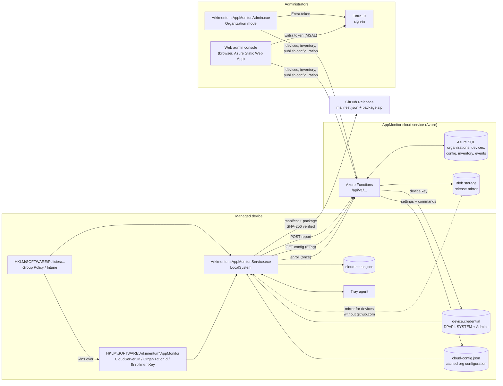
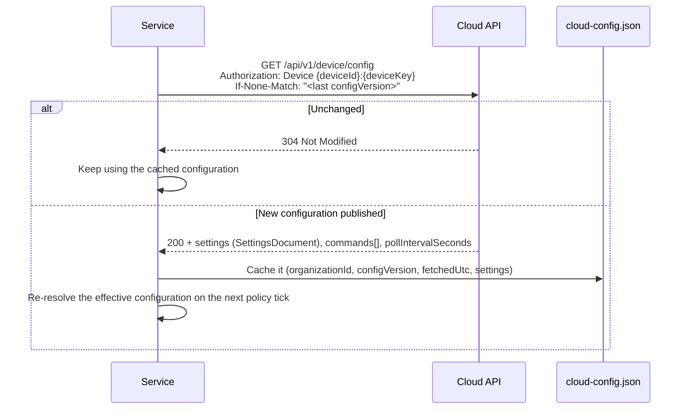
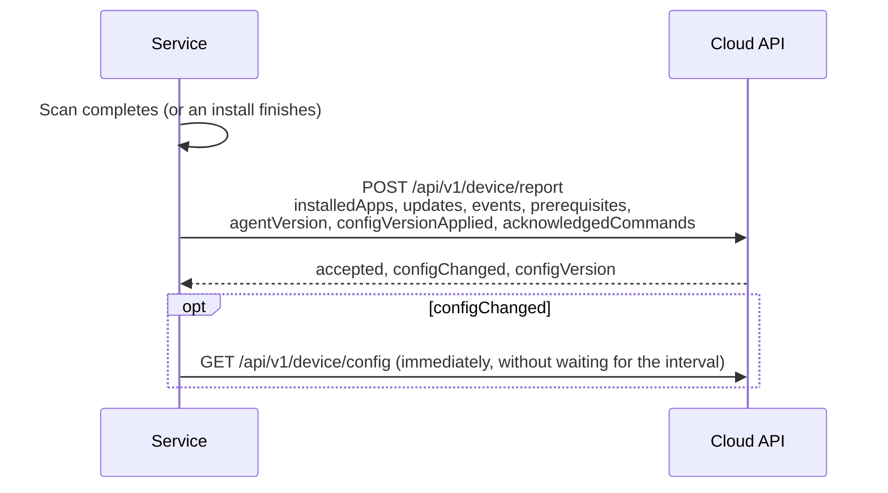
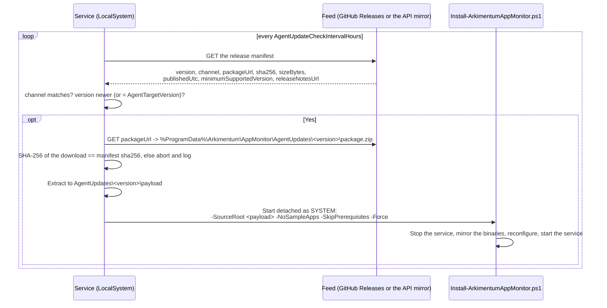

# The cloud service

The cloud service is where an organization is managed: the configuration is published once in the
admin console and every enrolled device collects it, reports what it found and what it did, and
takes commands from the console. A device can also run without it, with the whole configuration in
the registry and updates from winget and vendor sites; what still leaves such a device is the agent
self-update check and the winget or vendor traffic of the updates themselves, each of which can be
switched off.

With it in place you provision **three registry values per device** and nothing else. Everything the
agent needs afterwards - which applications to monitor, how mandatory they are, deadlines, deferrals,
log levels - is published once for the organization and collected by every device on its own.

| Without the cloud | With the cloud |
| --- | --- |
| Configuration pushed to every device (`.reg`, Intune script, Group Policy) | Three connection values per device; the rest published once |
| A configuration change is a deployment | A configuration change is a *Publish* in the web admin console - in a browser, nothing installed |
| No fleet view; one device at a time | Devices and Inventory pages across the organization |
| "Is this machine patched?" answered per machine | Answered for the fleet, with versions and device counts |
| New agent versions deployed by Intune / RMM | The agent updates itself from signed releases |
| Nothing reported anywhere; only the self-update check and the update downloads themselves leave the device | The device reports its inventory and update state ([exact fields](#what-leaves-the-device)) |

Nothing is taken away. The Policies key still wins over everything, `.reg` files and the admin console
still work, and a device that cannot reach the service keeps running on what it cached.

Operators deploying the backend itself (Azure Functions, Azure SQL, Blob storage, the Static Web App that
hosts the web admin console, Entra ID app registrations, Bicep, `Deploy-Cloud.ps1`) want
[`cloud/README.md`](../cloud/README.md) instead. This page is about the **devices** and the people who
provision them.

## Architecture



There is still **no inbound connection to the device**: every arrow from the device is outbound HTTPS
that the device itself initiates. "Commands from an administrator" are queued server-side and picked
up on the device's next poll - the console cannot reach into a machine.

| Component | Where | Purpose |
| --- | --- | --- |
| Device side | `src\Arkimentum.AppMonitor.Core\Cloud\` (`CloudClient`, `CloudConfigCache`, `DeviceCredentialStore`, `CloudContracts`) | Enrol, fetch configuration, report, read release manifests |
| Wire contracts | `CloudContracts.cs`, routes in `CloudRoutes` | The exact JSON both sides serialise; camelCase, string enums, nulls omitted |
| Backend | `cloud\` | Azure Functions API, Azure SQL, Blob, Bicep, `Deploy-Cloud.ps1` |
| Web admin console | Browser, hosted on an Azure Static Web App (`cloud\web\`) | **The console.** Devices, Inventory, Organization settings/applications, Enrollment |
| Desktop console | Organization mode, see [`AdminConsole.md`](AdminConsole.md#organization-mode) | The same organization pages in `Arkimentum.AppMonitor.Admin.exe`, plus the local "This machine" pages |

### Where you manage an organization

The **web admin console** is the primary console. It is a browser application - nothing to install, nothing to
elevate, works from any machine including a Mac - hosted on an Azure Static Web App next to the API. Its URL is
printed by `Deploy-Cloud.ps1` and looks like `https://appmon-prod-web-ab12cd.azurestaticapps.net` (or your own
custom domain). Sign in with your work account; what you may see and change comes from the app roles on the
AppMonitor API in your tenant, exactly as before:

| App role | What it gives |
| --- | --- |
| `AppMonitor.Admin` | manage the one organization mapped to your Entra tenant |
| `AppMonitor.GlobalAdmin` | Arkimentum staff only, and only from the operator tenant: manage every organization |

Publishing a configuration, queueing a command, deleting a device and rotating the enrollment key are the same
operations against the same API whichever console you use - they are admin API calls, not console features. The
desktop console (`Arkimentum.AppMonitor.Admin.exe`) keeps its organization mode for anyone who prefers it, and
remains the place for the machine-local pages; those local pages are deprecated, see
[`AdminConsole.md`](AdminConsole.md).

## The three values

| Registry value | Type | Example | Where it comes from |
| --- | --- | --- | --- |
| `CloudServerUrl` | `REG_SZ` | `https://appmonitor-contoso.azurewebsites.net` | The API's base URL, from `Deploy-Cloud.ps1` output or the Enrollment page |
| `CloudOrganizationId` | `REG_SZ` | `3f2504e0-4f89-11d3-9a0c-0305e82c3301` | The organization GUID, Enrollment page |
| `CloudEnrollmentKey` | `REG_SZ` | `ek_live_…` | The organization enrollment key, Enrollment page |

They live in either configuration key. Put them in the **Policies** key if you want them locked, or in
the **preference** key if the installer or a script should write them. The cloud can never override
them - see [Precedence](#precedence).

All the other `Cloud*` and `Agent*` values have working defaults and only need setting when you want
to change the behaviour:

| Value | Type | Default | Meaning |
| --- | --- | --- | --- |
| `CloudSyncIntervalMinutes` | DWORD | 15 (1-1440) | Minutes between syncs (configuration + report + commands). |
| `CloudConfigEnabled` | DWORD | 1 | Apply the organization configuration. 0 = enrol and report, configure locally. |
| `CloudReportingEnabled` | DWORD | 1 | Send inventory and update state. 0 = fetch configuration only. |
| `AgentAutoUpdate` | DWORD | 1 | Let the agent replace itself with a newer release. |
| `AgentUpdateFeedUrl` | SZ | `https://api.github.com/repos/woodyard/AppMonitor/releases/latest` | A GitHub releases API URL (`.../releases/latest` or `.../releases/tags/v1.2.0`) or a direct `manifest.json` URL. Empty = the cloud API's mirror. Public repositories only - no token is ever sent. |
| `AgentUpdateChannel` | SZ | `stable` | `stable` or `preview`. |
| `AgentUpdateCheckIntervalHours` | DWORD | 12 (1-720) | Hours between release checks. |
| `AgentTargetVersion` | SZ | *(empty)* | Ceiling: a published version newer than this is skipped. Empty = newest in the channel. |

Full reference, including types and clamping: [`Registry.md`](Registry.md#organization-and-updates).

## Data flows

### 1. Enrollment - once per device

```mermaid
sequenceDiagram
    participant S as Service (LocalSystem)
    participant A as Cloud API
    participant D as device.credential

    S->>S: Read CloudServerUrl, CloudOrganizationId, CloudEnrollmentKey
    S->>S: No device.credential yet
    S->>A: POST /api/v1/device/enroll<br/>organizationId, enrollmentKey, deviceName,<br/>machineGuid, entraTenantId, entraDeviceId, osVersion, agentVersion
    A->>A: Verify the key against the organization; match machineGuid to an existing device or create one
    A-->>S: deviceId, deviceKey (shown once), organizationName, configVersion
    S->>D: DPAPI-protect (LocalMachine) and write; ACL = SYSTEM + Administrators
    Note over S,A: The enrollment key is never sent again.
```

`MachineGuid` is `HKLM\SOFTWARE\Microsoft\Cryptography\MachineGuid` - stable for the life of the
Windows installation. A device that is re-imaged gets a new one and appears as a new device; a device
whose agent is reinstalled keeps the same one and re-attaches to the same record instead of creating a
duplicate.

### 2. Configuration - every sync interval



The settings the server sends use exactly the same schema as the admin console's JSON profile
(`SettingsDocument`), so what you export from one machine and what you publish for an organization are
the same shape. `pollIntervalSeconds` lets the server ask for a longer interval than
`CloudSyncIntervalMinutes` (back-off under load); it never shortens it below what you configured.

### 3. Reporting - after every scan



Reporting is skipped entirely when `CloudReportingEnabled = 0`; configuration still flows.

### 4. Commands - administrator to device

Commands are **queued**, not pushed. An administrator clicks a button in the console, the server adds a
command to the device's queue, and the device finds it in the `commands[]` array of its next
configuration response - so the latency is at most one `CloudSyncIntervalMinutes`. A user who presses **Check now**
in the tray shortens that: the agent pulls the configuration (commands included) before that scan.

| Command | `DeviceCommandKind` | What the agent does |
| --- | --- | --- |
| Scan now | `ScanNow` | Runs a full scan immediately, out of band with the scan interval. |
| Report now | `ReportNow` | Sends a report from the current state without scanning first. |
| Repair prerequisites | `RepairPrerequisites` | Runs the same check and repair as `--prerequisites` / `AutoInstallPrerequisites`. |
| Update agent | `UpdateAgent` | Runs the self-update check and installs a newer release if there is one, regardless of `AgentAutoUpdate`. |

Each command carries a `commandId`. The agent lists the ones it has processed in
`acknowledgedCommands` on its next report, so nothing is executed twice and the console can show the
outcome.

### 5. Self-update



The installer is run **detached** precisely because it stops the service that started it: the update
survives its own parent exiting. It is run with:

- `-SourceRoot <extracted folder>` - a temporary folder, not the install folder;
- `-NoSampleApps` - an upgrade must never re-create the starter applications;
- `-SkipPrerequisites` - winget was already dealt with by the running agent;
- `-Force` - overwrite the binaries and reconfigure the service definition without asking.

`Install-ArkimentumAppMonitor.ps1` is written for exactly this: it asks no questions, reads nothing
from the console, uses `$PSScriptRoot` only as the *default* for `-SourceRoot`, and skips the tray-agent
launch when it is running as SYSTEM. Pass `-LogFile` to capture a transcript when there is no console.

The configuration, `state.json`, `device.credential` and `cloud-config.json` all live outside the
install folder and survive the upgrade untouched.

`minimumSupportedVersion` is **advisory**: an agent below it logs a warning and updates; it is not a
gate the server enforces.

Before it hands over, the updater writes `update-pending.json` in the state directory (from-version,
to-version, start time). The next service start reads it: a changed version is logged as *Agent
updated* and reported as an `AgentUpdated` event, and a version that has not changed after 30 minutes
is logged as a failed update. The installer's own output is captured in
`AgentUpdates\<version>\install.log`, and the two most recent package folders are kept so a failed
update can be inspected.

An update is postponed while an application install is running, or while a previous agent update
started less than 30 minutes ago.

Releases are produced by `.github/workflows/release.yml` on a `v*` tag; the mechanics, the feed URL
forms and the manifest schema are in [`SelfUpdate.md`](SelfUpdate.md).

## Security model

### Per-device keys

The enrollment key is an **organization** secret, used exactly once per device and then never sent
again. What authenticates every later call is a **per-device key** that only that device has:

- issued by the server at enrolment and returned exactly once;
- stored DPAPI-protected (`DataProtectionScope.LocalMachine`, with an application-specific entropy
  value) in `%ProgramData%\Arkimentum\AppMonitor\device.credential`;
- the file's ACL is replaced with inheritance disabled and only `SYSTEM` and `BUILTIN\Administrators`
  granted access, so a standard user cannot read it even before DPAPI is considered;
- sent as `Authorization: Device {deviceId}:{deviceKey}` over TLS - `CloudClient` refuses a
  `CloudServerUrl` that is not `https` (loopback excepted, for a local backend during development);
- rotated by re-enrolling: delete `device.credential` and the agent enrols again, receives a new key
  and re-attaches to the same device record through `MachineGuid`.

Compromise of the enrollment key lets someone register a *new* device in the organization - it does not
let them read another device's data or impersonate it. Rotate it on the Enrollment page when a device
that carried it is lost; devices that have already enrolled are unaffected.

### Hashing

- **Secrets at rest on the server.** Enrollment keys and device keys are random 256-bit values
  (base64url, 43 characters) stored only as their SHA-256, and compared in fixed time so a caller
  cannot learn a key byte by byte from response timing. No salt is used, and none is needed: these are
  full-entropy random secrets, not passwords, so there is no dictionary to precompute. The plaintext
  device key exists only in the enrolment response and in `device.credential` - which is why the
  console can rotate an enrollment key but never show an existing one again
  (`EnrollmentInfoResponse.EnrollmentKey` is populated only immediately after creation or rotation).
- **Enrolment is rate-limited** per client IP and per organization, so the enrolment endpoint cannot be
  used to grind at a key.
- **Release packages.** Every downloaded package is hashed with SHA-256 and compared with the
  manifest's `sha256` before anything is extracted or executed. A mismatch aborts the update and is
  logged as an error; nothing is installed.
- **Application downloads** keep working exactly as before: `Sha256` / `Sha256Url` per application,
  verified before the installer runs.

### Tenant isolation

- Every device row, inventory row, event and configuration version is scoped to an `organizationId`,
  and the device credential carries the organization it belongs to. A device can only ever read or
  write within its own organization.
- Administrators sign in with **Entra ID**; either console asks the API for
  `/api/v1/public/auth-config` (client id, authority, scope) and then presents a bearer token. Which
  organizations a signed-in administrator may see comes back from `/api/v1/admin/me`
  (`AdminMeResponse.Organizations`) - the console never chooses on its own. The web console does the
  same from the browser with MSAL, and the API accepts its cross-origin calls only from the console's
  own origin (the Function App's CORS list is exactly that origin plus whatever the operator added).
- The device endpoints and the admin endpoints are different route prefixes with different
  authentication schemes: a device key is useless against `/api/v1/admin/*`, and an Entra token is
  useless against `/api/v1/device/*`.

### What leaves the device

**At enrolment** (`EnrollRequest`, once per device, and again only if the device has to re-enrol): the
organization id and the enrollment key, the computer name, the `MachineGuid`, the Entra tenant id and
Entra device id when the machine is Entra-joined, the OS version and the agent version.

**Afterwards**, with `CloudReportingEnabled = 1` (the default), a report contains exactly the fields of
`DeviceReport` in `CloudContracts.cs`, and nothing else:

**About the device**

| Field | Example |
| --- | --- |
| `reportedUtc` | timestamp of the report |
| `agentVersion` | `1.4.2` |
| `osVersion` | `10.0.26100` |
| `deviceName` | the computer name |
| `lastLogonUser` | the account of the last interactive logon |
| `lastScanUtc` | when the last scan ran |
| `configVersionApplied` | which published configuration the device is on |
| `prerequisites` | winget healthy or not, its detected version and path, last error |

**Installed applications** (`ReportedApp`, one per installed application): `displayName`, `version`,
`publisher`, `wingetId`, `availableVersion`, `context` (system or user), `catalogAppId`,
`monitoredAppId`.

**Tracked updates** (`ReportedUpdate`, one per monitored application): `appId`, `displayName`,
`installedVersion`, `availableVersion`, `state`, `context`, `mandatory`, `deadlineUtc`,
`deferredUntilUtc`, `deferralCount`, `firstDetectedUtc`, `installedAtUtc`, `lastError`.

**Events since the last report** (`ReportedEvent`): `occurredUtc`, `kind` (update detected, install
succeeded, install failed, deferred, forced close, prerequisite repaired, agent updated), `appId`,
`message`, `fromVersion`, `toVersion`.

**Acknowledged command ids.**

What is **never** collected: file contents, file or document names, folder listings, browsing history,
e-mail, clipboard, screenshots, keystrokes, user passwords or tokens, the contents of the registry
beyond the agent's own keys, hardware inventory, or location. The enrollment key is not echoed back,
and the device key is never transmitted in a report body.

This is still personal data in most jurisdictions: `deviceName` and `lastLogonUser` identify a person,
and the installed-application list says something about them. Treat the organization's database the way
you treat your other endpoint-management data, and tell your users it exists. Setting
`CloudReportingEnabled = 0` keeps the configuration benefits with nothing reported.

### Retention

What the design keeps, and for how long:

| Data | Kept |
| --- | --- |
| Device record and its latest snapshot (inventory, tracked updates, prerequisites) | While the device exists in the organization. The snapshot is **replaced** by each report, not accumulated. |
| Events (install outcomes, deferrals, forced closes, agent updates) | Appended per report; pruned on the operator's schedule |
| Configuration versions (for rollback and "who changed what") | Retained so a publish can be traced and rolled back |
| Enrollment key | Until rotated, and only as a hash |
| Device key | Until the device re-enrols or is deleted, and only as a hash |

Deleting a device on the Devices page removes its rows; it does not reach the machine. Uninstall or
un-provision the agent there as well, or it simply enrols again on its next sync. Removing an
organization removes everything under it.

The concrete pruning intervals are an **operator setting** on the backend rather than something the
device controls - see [`cloud/README.md`](../cloud/README.md) for the values in force in your
deployment, and set them to match your own retention policy before you enrol a fleet.

### Code signing

Production binaries and the installer script **should be Authenticode-signed**. It matters more with
self-update than without it: the device downloads a package over the internet and runs a PowerShell
script out of it as SYSTEM. SHA-256 verification proves the package is the one the manifest describes;
a signature proves who built it.

Where it plugs in: `deploy\Build-Release.ps1` is the single place that produces the payload. A
`-SignCertificateThumbprint` parameter there would sign the three executables and the shipped `.ps1`
files after the publish step and before the zip is created - so the SHA-256 in the manifest covers the
signed files - with an RFC 3161 timestamp, verified with `Get-AuthenticodeSignature` before packaging.
That parameter is **not implemented yet**; the `.NOTES` section of `Build-Release.ps1` spells out
exactly what it would do. Until it exists, sign in your own release pipeline between
`Build-Release.ps1 -SkipZip` and packaging, and consider a WDAC or AppLocker publisher rule so an
unsigned look-alike cannot take the agent's place.

## Provisioning the three values

### Intune - platform script (the simplest)

Devices → Scripts and remediations → **Platform scripts** → Add → Windows 10 and later. Run in 64-bit
PowerShell, run as system, do not enforce signature check.

```powershell
# Arkimentum AppMonitor - organization connection
$key = 'HKLM:\SOFTWARE\Arkimentum\AppMonitor'
New-Item -Path $key -Force | Out-Null
New-ItemProperty -LiteralPath $key -Name 'CloudServerUrl'      -Value 'https://appmonitor-contoso.azurewebsites.net' -PropertyType String -Force | Out-Null
New-ItemProperty -LiteralPath $key -Name 'CloudOrganizationId' -Value '3f2504e0-4f89-11d3-9a0c-0305e82c3301'         -PropertyType String -Force | Out-Null
New-ItemProperty -LiteralPath $key -Name 'CloudEnrollmentKey'  -Value 'ek_live_replace_me'                            -PropertyType String -Force | Out-Null
# Apply within one policy tick instead of at the next service start.
Restart-Service ArkimentumAppMonitor -ErrorAction SilentlyContinue
```

A platform script runs once per device (and again when you change it). Anyone who can read the script
in Intune can read the enrollment key - the same is true of any secret you hand to a device.

### Intune - Win32 app (install and connect in one step)

Wrap the release package with `IntuneWinAppUtil.exe` and use the installer's own parameters, so the
device is installed and connected in a single deployment:

```text
Install command:
%windir%\sysnative\WindowsPowerShell\v1.0\powershell.exe -NoProfile -ExecutionPolicy Bypass -File .\Install-ArkimentumAppMonitor.ps1 -NoSampleApps -SkipPrerequisites -CloudServerUrl "https://appmonitor-contoso.azurewebsites.net" -CloudOrganizationId "3f2504e0-4f89-11d3-9a0c-0305e82c3301" -CloudEnrollmentKey "ek_live_replace_me" -LogFile "%ProgramData%\Arkimentum\AppMonitor\Logs\intune-install.log"

Uninstall command:
%windir%\sysnative\WindowsPowerShell\v1.0\powershell.exe -NoProfile -ExecutionPolicy Bypass -File .\Uninstall-ArkimentumAppMonitor.ps1 -RemoveConfiguration -RemoveData

Install behaviour: System
Detection rule:    Custom script — deploy\Detect-ArkimentumAppMonitor.ps1 (file version >= the package version;
                   "at least", never "equals": the agent updates itself, so devices run newer builds than the package)
                   or File — %ProgramFiles%\Arkimentum\AppMonitor\Service\Arkimentum.AppMonitor.Service.exe,
                   version greater than or equal to the package version, "32-bit app" = No
```

The Intune Management Extension is a 32-bit process, so a bare `powershell.exe` starts the 32-bit host. Both
scripts re-launch themselves in the 64-bit host when that happens (since 1.1.2; 1.1.1 and earlier refused to
run and the install failed with "Run this script in 64-bit PowerShell"), and the `sysnative` path above starts
the right host in the first place.

Deploying the **1.1.1 package** through Intune needs two additions to the command above: the `sysnative` path,
and `-SourceRoot .` at the end. Windows PowerShell 5.1 leaves `$PSScriptRoot` empty while it evaluates the
parameter defaults of a script started with `-File`, so the 1.1.1 installer failed with "Cannot bind argument to
parameter 'LiteralPath' because it is an empty string"; `-SourceRoot .` names the package folder explicitly
(Intune runs the command inside it). From 1.1.2 the installer resolves its folder itself.

The transcript written by `-LogFile` starts with the full command line, enrollment key included, and
`%ProgramData%` logs are readable by every user of the device. Either leave `-LogFile` off once the rollout is
proven, or provision the three cloud values as policy registry values instead of on the command line.

Use `-SkipPrerequisites` in an Intune install: the ESP has enough to do, and the service runs the
prerequisite check itself shortly after it starts. Add `-NoAutoUpdate` if Intune should remain the only
thing that ever replaces the binaries.

### Intune / Group Policy

Write `CloudServerUrl`, `CloudOrganizationId` and `CloudEnrollmentKey` as `REG_SZ` values under
`HKLM\SOFTWARE\Policies\Arkimentum\AppMonitor` - with an Intune configuration profile (Settings
Catalog → Registry, or a custom profile), an Intune platform script, or a Group Policy preference.

Policy-provisioned values are read-only for the agent and the consoles and cannot be changed locally -
the right choice when the connection must not be tampered with. Restrict who can read the profile or
GPO: the enrollment key is in it.

The same key also takes `CloudSyncIntervalMinutes`, `CloudConfigEnabled` and
`CloudReportingEnabled`, plus the agent-update values; see [`Registry.md`](Registry.md).

### Manually, on one machine

```powershell
# elevated, 64-bit
$key = 'HKLM:\SOFTWARE\Arkimentum\AppMonitor'
New-Item -Path $key -Force | Out-Null
Set-ItemProperty -LiteralPath $key -Name CloudServerUrl      -Value 'https://appmonitor-contoso.azurewebsites.net'
Set-ItemProperty -LiteralPath $key -Name CloudOrganizationId -Value '3f2504e0-4f89-11d3-9a0c-0305e82c3301'
Set-ItemProperty -LiteralPath $key -Name CloudEnrollmentKey  -Value 'ek_live_replace_me'
Restart-Service ArkimentumAppMonitor

& "$env:ProgramFiles\Arkimentum\AppMonitor\Service\Arkimentum.AppMonitor.Service.exe" --cloud-status
```

Or on an existing install, with the installer:

```powershell
.\Install-ArkimentumAppMonitor.ps1 `
    -CloudServerUrl 'https://appmonitor-contoso.azurewebsites.net' `
    -CloudOrganizationId '3f2504e0-4f89-11d3-9a0c-0305e82c3301' `
    -CloudEnrollmentKey 'ek_live_replace_me'
```

The three values are written as `REG_SZ` only when you pass them; anything already configured on the
device is left exactly as it is. The **Enrollment** page of the web admin console (and of the desktop
console's organization mode) generates all of these snippets with the real values filled in.

### Network requirements

Outbound HTTPS (443) from the **SYSTEM** account to:

| Host | For |
| --- | --- |
| Your `CloudServerUrl` host | Enrolment, configuration, reports, commands, the release mirror |
| `api.github.com`, `github.com`, `objects.githubusercontent.com` | The release manifest and package, when `AgentUpdateFeedUrl` points at GitHub. Public repositories only - the agent sends no token, so a private repository has to be mirrored through the cloud API or a URL of your own. |
| `aka.ms`, `nuget.org`, `www.powershellgallery.com`, `psg-prod-eastus.azureedge.net` | The existing winget prerequisite repair (unchanged) |

`ProxyUrl` applies to the cloud client as well as to web sources. On a device that must not reach
github.com, leave `AgentUpdateFeedUrl` empty and let the API mirror the release.

## Precedence

The cloud adds one layer, between policy and local preferences:

| # | Layer | Where | Who writes it |
| --- | --- | --- | --- |
| 1 (wins) | Policy | `HKLM\SOFTWARE\Policies\Arkimentum\AppMonitor` | Group Policy, Intune |
| 2 | **Organization configuration** | `%ProgramData%\Arkimentum\AppMonitor\cloud-config.json` | Published in the console, cached on the device |
| 3 | Local preference | `HKLM\SOFTWARE\Arkimentum\AppMonitor` | The installer, the admin console, scripts |
| 4 | Catalog | `catalog.json` | Shipped, or `CatalogPath` (per-app identity/source/detection only) |
| 5 | Built-in default | - | The code |

Two rules on top of that:

- **`CloudConfigEnabled` is decided from the registry only.** If layer 2 could turn itself on, an
  administrator could never turn it off from a device.
- **Layer 2 can never supply `CloudServerUrl`, `CloudOrganizationId` or `CloudEnrollmentKey`.** Those
  values are how the device reached the cloud in the first place; letting the cloud rewrite them is how
  a fleet gets lost. The agent drops them from the cloud layer even if the server sends them.

Precedence is **per value**, not per layer: one application can take its deadline from policy, its
process names from the catalog and everything else from the organization configuration.

### Worked example 1 - policy wins over cloud

An organization publishes `ScanIntervalMinutes = 240`. One department's GPO sets it to 60 because their
line-of-business application changes often.

| Layer | Value |
| --- | --- |
| Policy | `60` |
| Cloud | `240` |
| Preference | `480` (left over from the original install) |

Effective: **60**, source `Policy`. The console shows the value greyed out as policy-managed on those
machines, and the fleet view shows them running a configuration version they have only partly applied -
which is correct and intended.

### Worked example 2 - cloud wins over the local preference

The installer wrote `LogLevel = Information` on every device. An administrator publishes
`LogLevel = Debug` for the organization while chasing a problem.

| Layer | Value |
| --- | --- |
| Policy | *(not set)* |
| Cloud | `Debug` |
| Preference | `Information` |

Effective: **Debug**, source `Cloud`. Nothing was deployed to any device; on their next sync (at most
`CloudSyncIntervalMinutes`, or right away when someone presses **Check now** in the tray) they cache the new
configuration and pick it up at the following policy tick. Unpublishing it puts every device back on `Information` just as quickly - the preference was never
overwritten, only out-ranked.

### Worked example 3 - the connection values are never cloud-supplied

Someone publishes `CloudServerUrl = https://wrong.example.com` for the organization, by mistake or
otherwise.

| Layer | Value |
| --- | --- |
| Cloud | `https://wrong.example.com` (**dropped**) |
| Preference | `https://appmonitor-contoso.azurewebsites.net` |

Effective: **`https://appmonitor-contoso.azurewebsites.net`**. Devices keep talking to the server they
were provisioned with, and the mistake can be corrected in the console. The same protection applies to
`CloudOrganizationId` and `CloudEnrollmentKey`.

### Worked example 4 - an application from three layers

`Apps\chrome` with policy setting `DeadlineHours = 24`, the organization configuration setting
`Mandatory = 1` and `MaxDeferrals = 3`, and the catalog supplying `WingetId` and `ProcessNames`:

| Value | Effective | From |
| --- | --- | --- |
| `DeadlineHours` | 24 | Policy |
| `Mandatory` | 1 | Cloud |
| `MaxDeferrals` | 3 | Cloud |
| `WingetId` | `Google.Chrome` | Catalog |
| `ProcessNames` | `chrome` | Catalog |
| `CloseGracePeriodMinutes` | 15 | Built-in default |

`--show-config` prints the layer for every value, which is the fastest way to settle any argument about
which one won.

## Offline behaviour

Losing the network changes nothing about update management.

- The organization configuration is **cached on disk** (`cloud-config.json`) and read from there on
  every configuration resolve, not fetched per read. A device that has synced once keeps that
  configuration through reboots, through weeks offline, and through a server outage.
- Scans, notifications, deferrals, deadlines and installs carry on as normal - they never depended on
  the cloud.
- Reports accumulate the events that happened while offline and go out with the first successful
  report afterwards.
- A failed sync is logged at warning level and retried with an exponential back-off from 30 seconds up
  to a ceiling of one hour (`Cloud sync retry N in <delay>` in the log). It never blocks the scan loop
  and never gives up permanently.
- A device that has **never** synced has no cached configuration and runs entirely on policy, local
  preferences, catalog and defaults - which is exactly the stand-alone behaviour.
- Self-update simply does not happen while the feed is unreachable, and resumes when it is.

The only thing that stops working offline is the console's view of that device: it shows the device as
not seen since its last report, and any command queued for it waits until it comes back.

## Troubleshooting

### Start with the status file

`%ProgramData%\Arkimentum\AppMonitor\cloud-status.json` is what the agent thinks of its cloud link:
`serverUrl`, `organizationName`, `deviceId`, `enrolledUtc`, `lastConfigVersion`, `lastConfigUtc`,
`lastReportUtc` and `lastError`.

```powershell
Get-Content "$env:ProgramData\Arkimentum\AppMonitor\cloud-status.json" | ConvertFrom-Json | Format-List
```

Self-update state is kept separately: `update-pending.json` while an update is in flight, and
`AgentUpdates\<version>\install.log` for the installer's own output.

### Service switches

| Switch | Effect | Exit codes |
| --- | --- | --- |
| `--cloud-status` | Print the cloud status - the file's content plus the effective settings, whether a device credential is present, and what is cached - then exit. Read-only, so it is safe while the service is running. | 0 |
| `--cloud-enroll` | Enrol now: use the configured key, obtain a device key, write `device.credential`. | 0 = enrolled, 1 = failed |
| `--report-now` | Build and send a report immediately. | 0 = sent, 1 = failed |
| `--check-update` | Read the release feed, print the decision, install nothing. | 0 = nothing to do, 2 = an update is available, 1 = the feed could not be read |
| `--update-now` | Check, download, verify and start the installer. | 0 = installer started or nothing to do, 1 = failed |

```powershell
$svc = "$env:ProgramFiles\Arkimentum\AppMonitor\Service\Arkimentum.AppMonitor.Service.exe"
& $svc --cloud-status
& $svc --show-config      # every value with the layer it came from, including Cloud
```

### Symptoms

**The device never appears in the console.**
Check all three values are present and in the *64-bit* view
(`Get-ItemProperty 'HKLM:\SOFTWARE\Arkimentum\AppMonitor' | Select Cloud*`). A 32-bit script writes to
`WOW6432Node`, where the agent does not look. Then `--cloud-enroll` and read the error it prints.

**`device.credential` exists but every call returns 401/403.**
The device key was revoked, or the device was deleted in the console. The agent handles this itself: it
logs *the cloud API rejected the device credential … the device will re-enroll* and enrols again on the
next attempt, re-attaching to the same record by `MachineGuid`. Force it with `--cloud-enroll`; deleting
`%ProgramData%\Arkimentum\AppMonitor\device.credential` first is only needed if the file is corrupt.

**Enrolment fails with an invalid key.**
The enrollment key was rotated after the device was provisioned. Provision the current key - already
enrolled devices are not affected by a rotation, only new ones.

**"must use https".**
`CloudClient` refuses a non-HTTPS `CloudServerUrl` (loopback excepted). Fix the value; do not work
around it.

**Configuration published but the device is still on the old one.**
It syncs at most every `CloudSyncIntervalMinutes` and applies at the next `PolicyTickSeconds`. Compare
`configVersion` in `cloud-status.json` with the version shown in the console. If they match and the
value still looks wrong, it is being out-ranked by policy - `--show-config` says so.

**A published value has no effect at all.**
Either `CloudConfigEnabled = 0` on that device, or the value is one of the three connection values,
which the cloud cannot set (by design).

**Nothing is reported, but configuration arrives.**
`CloudReportingEnabled = 0`.

**Self-update never runs.**
`AgentAutoUpdate = 0`; or no `AgentUpdateFeedUrl` **and** no cloud server, so there is no feed; or the
manifest's channel does not match `AgentUpdateChannel`; or `AgentTargetVersion` pins the device to what
it already runs. `--check-update` prints which of these it is.

**Self-update fails at verification.**
The SHA-256 of the download did not match the manifest - a truncated download, a proxy rewriting the
body, or a package that is not the one that was published. The download is deleted and nothing is
installed. Re-run `--update-now`; if it repeats, the release itself is wrong.

**Self-update ran but the new version is not there.**
Read `%ProgramData%\Arkimentum\AppMonitor\AgentUpdates\<version>\install.log` - the installer's own
output - and `update-pending.json`, which the next service start turns into either an *Agent updated*
log line or a failed-update warning. The extracted payload is still in that folder, so the installer
can be re-run from it by hand.

### Log lines to look for

In `%ProgramData%\Arkimentum\AppMonitor\Logs\Arkimentum.AppMonitor.Service_yyyyMMdd.log`:

```text
Cloud sync is idle: CloudServerUrl/CloudOrganizationId are not configured   nothing is configured
Cloud API client targeting <url>                                            the client came up
Enrolling <device> with <url>/api/v1/device/enroll (organization ...)        enrolment attempt
Enrolled as device <id> in organization '<name>' (<id>)                      enrolment succeeded
Device credential stored at ... (device ..., organization ...)
Polling the organization configuration from <url> (device ..., known version ...)
Organization configuration unchanged (304 Not Modified, version ...)         nothing new
Organization configuration <v> from '<org>' applied: N global value(s), M app(s)
Cloud command <Kind> (<id>) issued <when> by <who>                           a queued command arrived
Reporting to <url> (<reason>): N installed app(s), M tracked update(s), ...
Report accepted=True, configChanged=False, serverConfigVersion=<v>
Cloud sync retry <n> in <delay>                                             back-off after a failure
The cloud API rejected the device credential (Unauthorized) ...; the device will re-enroll
Cached organization configuration at ... is unreadable and will be ignored
Device credential at ... could not be read; the device will re-enroll
```

Self-update lines all start with `Agent update`:

```text
Agent update check (<reason>): running <version>, channel <channel>
Agent update decision: <Outcome>: <reason>
Agent update: downloaded <package> (<bytes> bytes) to <path>; SHA-256 verified
Agent update: SHA-256 mismatch for <package> - manifest says <x>, the download is <y>; ...
Agent update: started the installer (pid <n>) from <dir>; this service will be stopped and replaced
```

Raise the level to `Debug` to see each sync, each 304, the report sizes and the self-update decision:

```powershell
Set-ItemProperty 'HKLM:\SOFTWARE\Arkimentum\AppMonitor' -Name LogLevel -Value Debug
Restart-Service ArkimentumAppMonitor
```

Remember that `LogLevel` can itself come from the organization configuration - if setting it locally
has no effect, the cloud is out-ranking you.

More: [`Troubleshooting.md`](Troubleshooting.md).

## Related

- [`Registry.md`](Registry.md) - every value, its type, range and layer
- [`AdminConsole.md`](AdminConsole.md#organization-mode) - the desktop console's organization mode, and
  what is deprecated in its local pages
- [`cloud/README.md` §8](../cloud/README.md#8-web-admin-console) - the web admin console: URL, hosting,
  how it is deployed and how to give it a custom domain
- [`SelfUpdate.md`](SelfUpdate.md) - release manifests, the GitHub workflow, the update installer
- [`Architecture.md`](Architecture.md) - components and flows
- [`cloud/README.md`](../cloud/README.md) - deploying and operating the backend
- `src\Arkimentum.AppMonitor.Core\Cloud\CloudContracts.cs` - the wire contracts, verbatim
